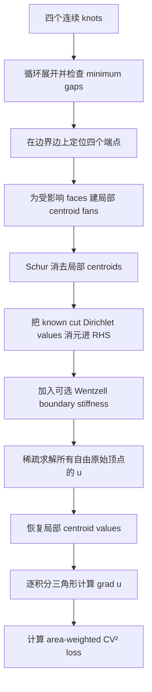
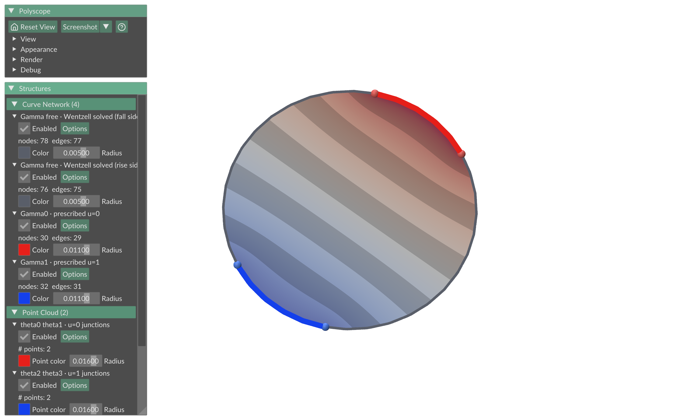

# 从零理解四参数连续边界优化

本文解释当前的
[`continuous_partial_opt.py`](continuous_partial_opt.py)
实现：四个连续边界参数、两段严格的 \(0/1\) Dirichlet 边界、局部
cut-cell FEM、可选 Wentzell 边界平滑，以及外层 SLSQP 优化。

这不是 API 手册。目标是从“为什么需要这个算法”开始，一直讲到代码里的每个
主要矩阵在做什么。文中的默认示例是 Disk，推荐演示参数为 \(\eta=3\)。

推荐阅读路线：第一次先读第 0–5、11、12 和 18 节建立直觉；第二次读第 6–10 节
理解离散实现；准备修改代码时再读第 14–17 节。

---

## 0. 先记住三个角色

整套算法只有三个角色：

| 角色 | 是什么 | 是否由外层优化器直接改变 |
|---|---|---:|
| design variables | 四个循环边界端点 \(\boldsymbol\xi=(\xi_0,\xi_1,\xi_2,\xi_3)\) | 是 |
| state | 网格上每个位置的标量场 \(u\) | 否，每次由线性 PDE 自动求解 |
| objective | 衡量 \(|\nabla u|\) 是否均匀的 loss | 外层最小化它 |

因此算法不是在同时优化几千个场值。它做的是：

```text
移动四个边界端点
        ↓
得到两段 u=0 / u=1 的边界弧
        ↓
自动解出整张 mesh 上的场 u
        ↓
评价场的梯度是否均匀
        ↓
继续移动四个端点
```

最紧凑的数学写法是：

\[
\boxed{
\begin{aligned}
u_\eta(\boldsymbol\xi)
&=
\arg\min_{u|_{\Gamma_0}=0,\;u|_{\Gamma_1}=1}
\left[
\frac12\int_\Omega |\nabla u|^2\,dA
+\frac\eta2\int_0^1 |u_\xi|^2\,d\xi
\right],\\[4pt]
\boldsymbol\xi^\star
&=
\arg\min_{\boldsymbol\xi\in\mathcal D_\delta}
CV_A^2\!\left(|\nabla u_\eta(\boldsymbol\xi)|^2\right).
\end{aligned}}
\]

第一行是“给定四个端点，场应该长什么样”；第二行是“四个端点应该放在哪里”。

---

## 1. 我们最终想得到什么？

输入是一张带边界的三角网格 \(\Omega\)。当前代码要求：

- mesh 在约束意义下连通；否则可能到 sparse solve 时才因未锚定分量而奇异；
- 三角形边流形；
- 恰好有一条闭合边界环；
- 边界边长度非零。

输出包括：

1. 四个优化后的连续边界坐标；
2. 一段严格满足 \(u=0\) 的边界弧 \(\Gamma_0\)；
3. 一段严格满足 \(u=1\) 的边界弧 \(\Gamma_1\)；
4. 整张 mesh 上的 harmonic-like 标量场 \(u\)；
5. 由 \(u\) 生成的内部等值线。

这里的 `min_curve` 和 `max_curve`，在当前实现里分别就是边界上的
\(\Gamma_0\) 与 \(\Gamma_1\)。因为整段分别严格等于 \(0\) 和 \(1\)，所以它们
本身就是场的等值线。其他中间等值线是在 PDE 求解之后自动出现的。

> 当前代码优化的是“一条外边界上的两段弧”，不是任意漂浮在 mesh 内部的两条
> 曲线。如果以后要优化任意内部曲线，那是另一个几何表示问题。

---

## 2. 如何用四个实数描述一整圈边界？

### 2.1 归一化弧长坐标

设边界按循环顺序包含顶点 \(b_0,b_1,\ldots,b_{m-1}\)，总周长为

\[
P=\sum_{j=0}^{m-1}\|b_{j+1}-b_j\|,
\qquad b_m=b_0.
\]

边界顶点 \(b_i\) 的归一化弧长坐标定义为

\[
\xi(b_i)=
\frac{\sum_{j=0}^{i-1}\|b_{j+1}-b_j\|}{P}
\in[0,1).
\]

所以 \(\xi=0\) 和 \(\xi=1\) 是同一个位置。若想以角度显示，只需使用

\[
\theta=2\pi\xi\in[0,2\pi).
\]

这个“角度”只是边界弧长坐标的显示方式，不是物体在三维空间中的极角。

### 2.2 四个有序端点

代码把四个端点展开成同一个循环内的严格顺序：

\[
\xi_0<\xi_1<\xi_2<\xi_3<\xi_0+1.
\]

它们把边界分成四段：

```text
xi0 ===== Gamma0: u=0 ===== xi1
    ----- free rise side ---- xi2
    ===== Gamma1: u=1 ===== xi3
    ----- free fall side ---- xi0 + 1
```

更正式地：

\[
\begin{aligned}
\Gamma_0   &= [\xi_0,\xi_1],\\
\Gamma_f^+ &= (\xi_1,\xi_2),\\
\Gamma_1   &= [\xi_2,\xi_3],\\
\Gamma_f^- &= (\xi_3,\xi_0+1).
\end{aligned}
\]

四个循环 gap 为

\[
\begin{aligned}
g_0&=\xi_1-\xi_0, &
g_1&=\xi_2-\xi_1,\\
g_2&=\xi_3-\xi_2, &
g_3&=\xi_0+1-\xi_3.
\end{aligned}
\]

它们满足

\[
g_i\geq\delta,
\qquad
\sum_{i=0}^3g_i=1.
\]

默认 \(\delta=0.03\)。它只防止某段退化成零长度，不规定最优弧宽。

这一版不再用 softmax gaps。四个 gaps 直接位于带下界的 simplex 上，由 SLSQP
处理上述线性约束，因此也没有 softmax 靠近最小 gap 时的 Jacobian 饱和问题。

四个参数也可以理解成：一个决定整组端点沿边界的绝对相位，另外三个决定四段
长度；第四个 gap 由总和为 \(1\) 自动确定。

---

## 3. 什么是 harmonic field？

先暂时忽略 Wentzell 项。给定两段 hard arcs 后，我们寻找满足

\[
u=0\quad\text{on }\Gamma_0,
\qquad
u=1\quad\text{on }\Gamma_1
\]

并最小化 Dirichlet energy 的场：

\[
E_0(u)=\frac12\int_\Omega|\nabla u|^2\,dA.
\]

可以把 \(u\) 想成一张弹性膜的高度：一段边界钉在高度 \(0\)，另一段钉在高度
\(1\)，剩余位置自由。系统选择不必要弯曲最少的平衡形状。

对内部场值作变分，会得到 Laplace 方程：

\[
\Delta_\Omega u=0\quad\text{inside }\Omega.
\]

这就是 harmonic。它不是“在两个值之间逐点做线性插值”，而是整个 mesh 上的
全局能量最小解。

给定四个端点后，inner energy 是关于场值的凸二次函数。只要 mesh 连通且 hard
arcs 能锚定常数零空间，state solution 是唯一的。非凸和 local minimum 问题来自
外层四端点优化，而不是这次线性 state solve。

---

## 4. Dirichlet、Neumann、Wentzell 到底有什么区别？

### 4.1 Dirichlet：直接规定场值

当前两段 hard arcs 使用：

\[
u=0\text{ on }\Gamma_0,
\qquad
u=1\text{ on }\Gamma_1.
\]

这两段不是“被拉向” \(0/1\)，而是严格等于 \(0/1\)。因此之前“loss 不保证
场真的从 \(0\) 到 \(1\)”的问题，在当前模型里由 hard constraints 解决，而不是
由 uniformity loss 解决。

### 4.2 Natural Neumann：不规定自由边界的值

如果只最小化 \(E_0\)，自由边界上的自然条件是

\[
\partial_\nu u=0\quad\text{on }\Gamma_f^+\cup\Gamma_f^-.
\]

\(\nu\) 是位于曲面切平面内、垂直于边界的外向 conormal。
\(\partial_\nu u=0\) 表示没有穿过边界的法向通量。

它绝不表示 \(u=0\)。自由边界上的每个值仍由整个 harmonic solve 自动决定。

在代码中，\(\eta=0\) 才是这个纯 mixed Dirichlet/Neumann 模型。

### 4.3 Wentzell：边界值仍自由，但边界自身也会扩散

当前实现允许在 inner state energy 中加入

\[
E_\eta(u)=
\frac12\int_\Omega|\nabla u|^2\,dA
+\frac\eta2\int_0^1
\left|\frac{\partial u}{\partial\xi}\right|^2d\xi.
\]

第二项惩罚沿边界的剧烈变化。它没有告诉任何中间边界点“你应该等于多少”，
而是让 bulk membrane 与 boundary string 联立达到平衡。

若物理弧长记作 \(s=P\xi\)，则

\[
\int_0^1|u_\xi|^2d\xi
=P\int_{\partial\Omega}|u_s|^2ds.
\]

因此物理形式的系数是

\[
\beta=\eta P,
\]

自由边界的 Euler–Lagrange 条件为

\[
\partial_\nu u-\beta\,\partial_{ss}u=0.
\]

它表示：来自内部场的法向通量，与边界上的切向扩散达到平衡。
自由弧的两个端点属于 hard Dirichlet arcs，变分在那里为零，因此不需要额外的
端点自然条件。

### 4.4 \(\eta\) 的三个重要区域

| \(\eta\) | 自由边界条件 | 直觉 |
|---:|---|---|
| \(0\) | pure natural Neumann | 自由边界只服从 bulk harmonic energy |
| 有限正数 | Wentzell | bulk 与 boundary diffusion 共同决定自由 trace |
| \(\eta\to\infty\) | 趋向弧长线性 trace | 一维边界能量占主导 |

当 \(\eta\to\infty\) 时，每条自由弧主要在解

\[
\min_v\int|v_\xi|^2d\xi
\]

并固定两端为 \(0,1\) 或 \(1,0\)。它的解满足 \(v_{\xi\xi}=0\)，所以趋向弧长
线性函数。

因此：

- “没有 prescribed transition”是正确的；
- “没有任何 transition preference”是不正确的；
- 大 \(\eta\) 接近旧 linear 模型，是设计出来的连续极限。

更精确地说，这个极限是在当前 augmented cut-boundary P1 space 中得到的弧长线性
trace。旧 `boundary_opt.py` 只在原 boundary vertices 上采样 profile；当 knot 落在
edge 内部时，两种离散场不会逐数值完全相同，只会趋向同一种连续语义。

> 重要：Wentzell energy 只改变 inner PDE。最终报告和优化的 outer loss 中没有
> 加上这项能量。

### 4.5 它与 Robin 条件有什么不同？

Robin 条件通常写成

\[
\partial_\nu u+\rho(u-g)=0.
\]

它像一根弹簧，把边界值软性拉向预先给定的目标 \(g\)。有限 \(\rho\) 下不保证
\(u=g\)，而且必须先定义目标 profile。

Wentzell 条件

\[
\partial_\nu u-\beta\partial_{ss}u=0
\]

没有目标 profile；它只让相邻边界值彼此平滑。当前模型在 \(\Gamma_0,\Gamma_1\)
上使用 hard Dirichlet，在另外两段使用 Wentzell，不使用 Robin penalty。

---

## 5. 为什么 loss 与等值线间距有关？

相邻两个等值线的场值差若为 \(\Delta u\)，局部几何距离近似为

\[
d\approx\frac{\Delta u}{|\nabla u|}.
\]

所以当 \(|\nabla u|\) 接近常数时，固定 \(\Delta u\) 的等值线间距也接近常数。

对每个积分三角形 \(f\)，定义

\[
q_f=|\nabla u|_f^2,
\qquad
w_f=\frac{A_f}{\sum_jA_j}.
\]

面积加权均值为

\[
\mu=\sum_fw_fq_f.
\]

当前 outer loss 是

\[
\begin{aligned}
J(u)
&=\frac{\sum_fw_fq_f^2}{\mu^2}-1\\
&=\frac{\operatorname{Var}_w(q)}{\mathbb E_w[q]^2}\\
&=CV_w^2\!\left(|\nabla u|^2\right).
\end{aligned}
\]

它有三个关键性质：

1. \(J\geq0\)；
2. 若所有三角形的 \(|\nabla u|\) 相同，则 \(J=0\)；
3. 把整个场乘一个常数不会改变 \(J\)。

第三点曾经是模型漏洞：仅靠这个 loss 不能保证场真正跨越 \(0\to1\)。当前模型
通过两段 hard Dirichlet arcs 严格固定 \(0\) 和 \(1\)，所以变化幅度不再依赖
loss 猜测。

但这个 loss 仍然只是等值线均匀性的 proxy。它没有直接测量：

- 每一对真实抽取等值线之间的 Hausdorff 距离；
- 等值线是否直；
- 等值线拓扑是否符合下游需求；
- 两段 hard arc 是否具有某个偏好的宽度。

代码另外报告的 `spacing_cv` 是 \(CV(|\nabla u|)\)，它更直观，但不是实际优化的
\(CV^2(|\nabla u|^2)\)。不要把两者混为一个数。

---

## 6. 三角网格上如何求 harmonic field？

### 6.1 每个顶点只有一个标量

对于一个普通三角形 \(f=(i,j,k)\)，P1 有限元把场写成

\[
u(x)=u_i\phi_i(x)+u_j\phi_j(x)+u_k\phi_k(x),
\]

其中 \(\phi_i,\phi_j,\phi_k\) 是重心基函数。在每个三角形内部，

\[
\nabla u=u_i\nabla\phi_i+u_j\nabla\phi_j+u_k\nabla\phi_k
\]

是常向量。

### 6.2 从能量得到 stiffness matrix

一个三角形对 Dirichlet energy 的贡献可以写成

\[
E_f=\frac12\mathbf u_f^TK_f\mathbf u_f,
\]

其中

\[
(K_f)_{ab}=A_f\,\nabla\phi_a\cdot\nabla\phi_b.
\]

把所有三角形的 \(K_f\) 加到全局矩阵，就得到 cotangent stiffness
\(K_\Omega\)。

### 6.3 固定值与自由值分块

将原始 mesh 顶点分成：

- \(C\)：值已固定的 hard-arc vertices；
- \(F\)：仍需求解的 vertices，包括 interior 和 free boundary vertices。

若暂时没有局部 cut RHS，全局平衡方程为

\[
(K_\Omega)_{FF}u_F
=-(K_\Omega)_{FC}u_C.
\]

这是一个稀疏线性系统。给定四个端点后，几千个 \(u_i\) 就由这一次 solve 自动
得到；它们不是外层设计变量。

---

## 7. 连续端点落在 mesh edge 中间怎么办？

这是当前实现最关键、也最容易误解的部分。

### 7.1 为什么不能什么都不做？

设一个端点位于原边 \((v_i,v_j)\) 内部：

\[
p=(1-t)v_i+t\,v_j,
\qquad0<t<1.
\]

端点左侧可能属于严格 \(u=0\) 的 hard arc，右侧却属于 free arc。若完全沿用
原始 P1 edge，而不承认 \(p\) 是一个 breakpoint，那么同一条边无法准确表达这种
边界条件切换。

可选方案只有几类：

1. 把端点吸附到最近的原顶点——参数不再真正连续；
2. 永久 remesh 并增加全局顶点——数据结构变动很大；
3. 使用 Nitsche、XFEM 一类更复杂的弱约束；
4. 只在受影响三角形内做局部 cut-cell integration。

当前实现选择第 4 种。

### 7.2 局部 centroid fan

若边界端点 \(p\) 切开一个三角形的边，局部积分示意为：

```text
v0 -------- p -------- v1
  \         |         /
   \        |        /
    \       c       /
     \     / \     /
      \   /   \   /
          v2
```

- \(p\) 是局部 cut endpoint，值已知为 \(0\) 或 \(1\)；
- \(c\) 是原三角形的几何重心；
- 从 \(c\) 向局部边界序列连线，得到一组 fan triangles；
- 每个 fan triangle 使用普通 P1 FEM 积分。

若同一条边或同一个三角形内出现多个端点，代码会先按几何顺序排列，再只覆盖
原三角形一次。

### 7.3 Schur complement：局部承认它们，全局消掉它们

fan 的局部刚度按 boundary references \(b\) 和 centroid \(c\) 分块：

\[
K_{\text{fan}}=
\begin{bmatrix}
K_{bb}&K_{bc}\\
K_{cb}&K_{cc}
\end{bmatrix}.
\]

局部中心满足

\[
K_{cb}u_b+K_{cc}u_c=0,
\]

所以

\[
u_c=-K_{cc}^{-1}K_{cb}u_b.
\]

将它代回后，得到只关于局部边界值的 condensed stiffness：

\[
\widehat K_{bb}
=K_{bb}-K_{bc}K_{cc}^{-1}K_{cb}.
\]

将局部 known cut DOFs 记为 \(D\)，其值记为 \(g_D\)。对应列进一步移到右端项：

\[
b_{\text{cut}}\leftarrow b_{\text{cut}}-K_{oD}g_D.
\]

最终结果是：

- 原始 `V/F` 完全不变；
- 全局 unknown vector 仍只有原始 mesh vertices；
- cut endpoints 只是局部已知 references；
- centroids 只是局部自由 DOFs，并在装配前消掉；
- 计算 loss 或显示时，centroid value 才按上式恢复。

所以准确说法是“没有全局虚拟顶点或全局 remeshing”，而不是“数值积分里完全没有
局部辅助点”。

---

## 8. Wentzell 项如何离散？

考虑 cut 后边界上的一个子段，归一化长度为 \(\Delta\xi_e\)，两端值为
\(u_a,u_b\)。线性插值下：

\[
\frac\eta2\int_e|u_\xi|^2d\xi
=\frac\eta{2\Delta\xi_e}(u_b-u_a)^2.
\]

先把不含权重的单位一维 P1 stiffness 定义为

\[
B_e^\Gamma=
\frac1{\Delta\xi_e}
\begin{bmatrix}
1&-1\\
-1&1
\end{bmatrix}.
\]

将所有 boundary subsegments 的 \(B_e^\Gamma\) 相加得到 \(B_\Gamma\)，实际加入
state matrix 的是 \(\eta B_\Gamma\)。

代码实际上沿整圈边界装配。这样做仍然等价于只在 free arcs 上装配，因为：

- \(\Gamma_0\) 上每段两端都是 \(0\)；
- \(\Gamma_1\) 上每段两端都是 \(1\)；
- 所以 hard arcs 上的 \((u_b-u_a)^2\) 严格为零。

这省掉了针对四种边界段写额外拓扑分支。

实现只保存会影响全局 state solve 的 matrix blocks 和 RHS。若一个极短 free
subsegment 的两端都是 known cut endpoints，它的 Wentzell energy 是关于 state 的
常数；代码会省略这个 known-only constant。它既不改变 inner argmin，也不进入
reported outer loss，因此不会改变当前求解结果。

加上 surface 与 boundary stiffness 后，可以抽象写成

\[
\widehat K_\eta(\boldsymbol\xi)
=\widehat K_\Omega(\boldsymbol\xi)+\eta B_\Gamma(\boldsymbol\xi).
\]

帽子强调 surface operator 已根据 knots 做过 cut-cell replacement 和 centroid
Schur condensation，并不是固定不变的原 mesh stiffness。

实际全局系统还包含 cut endpoints 消元产生的 RHS：

\[
(\widehat K_\eta)_{FF}u_F
=b_{\text{cut}}-(\widehat K_\eta)_{FC}u_C.
\]

`system_residual` 检查的是这个完整系统的残差；当 \(\eta>0\) 时，它不是“纯
Laplace residual”。

---

## 9. 一次 objective evaluation 的完整流程



伪代码可以压缩为：

```python
def evaluate(knots, eta):
    knots, gaps = canonicalize_cycle(knots)
    cuts = locate_continuous_endpoints(knots)
    A, b, known = assemble_cut_cell_system(cuts, eta)
    u_free = sparse_solve(A_free_free, b - A_free_known @ u_known)
    u = combine(u_known, u_free)
    gradients = reconstruct_and_integrate_gradients(u, cuts)
    return coefficient_of_variation_squared(gradients)
```

---

## 10. 外层如何优化四个参数？

最终外层问题是

\[
\min_{\boldsymbol\xi}
J\!\left(u_\eta(\boldsymbol\xi)\right)
\]

并满足四个线性循环 gap constraints。

当前实现直接优化 unwrapped knots，使用 constrained SLSQP。一次局部优化包括：

1. SLSQP 对四个参数做有限差分；
2. 每个差分采样都重新装配并求解一次 inner PDE；
3. 只有满足 minimum-gap constraints 的结果会成为 best-so-far；
4. 相同参数的重复 evaluation 会缓存。

在进入局部优化前，代码先评价几种 deterministic candidates：

- 调用者传入的初值，CLI 默认由 `random_knots(seed)` 生成；
- 四等分边界；
- 由边界 turning angle 最大的四个顶点产生的 feature start；
- feature start 的一次单步循环旋转，用于测试另一组交替边界弧作为 hard arcs。

它们按初始 loss 排序，最多选择 `starts` 个执行局部 SLSQP。

因此 `starts=2` 的意思不是“随机生成两个 seed”，而是“最多 refine 两个最有希望
的候选”。当前只验证了 \(\eta=3\)、`iterations=60`、`starts=1` 下 seeds 0–3
得到完全相同的 loss、knots 和 field；原因是确定性候选总是胜出。这不能证明目标
只有一个极小值，也不能外推到所有 \(\eta\) 或所有 seeds。

`history` 不是每一次 PDE evaluation 的逐项日志。local history 记录 SLSQP callback
时的 best-so-far，允许重复，末尾还可能补一次最终改进；global history 从调用者的
初值开始，可能先记录确定性候选造成的跳变，之后只追加严格改进。`iterations` 是
所有实际 local runs 的迭代数之和，`evaluations` 才更接近 state-solve 尝试次数。

### 10.1 当前 pipeline 是否完全可微？

固定四个端点各自所在的 boundary edges，并远离 snap threshold 时：

- endpoint position 对 knot 平滑；
- cut geometry 和局部 stiffness 平滑；
- 线性系统 \(A(\boldsymbol\xi)u=b(\boldsymbol\xi)\) 平滑；
- 在 \(A\) 非奇异时，

\[
\frac{\partial u}{\partial\xi_i}
=A^{-1}
\left(
\frac{\partial b}{\partial\xi_i}
-\frac{\partial A}{\partial\xi_i}u
\right).
\]

所以固定 active cell 内可以做隐式微分或伴随法。

但端点跨越原 mesh vertex 时：

- 所属 boundary edge 改变；
- hard constrained vertex 集合改变；
- cut-cell topology 改变；
- snap 分支可能切换。

因此每个固定 branch 内是 smooth 的，但 vertex/active-set crossing 通常不光滑。
另外，正的 `snap_tolerance` 会在 threshold 处把 cut point 直接切换为原 vertex，
所以还可能出现 \(O(\text{snap tolerance})\) 的数值微小不连续。当前代码也没有
实现解析 shape derivative，而是使用 SLSQP finite differences。准确结论是：

> 内层线性 solve 可微；固定 cut topology 和 snap branch 内的完整 evaluation
> 可微；当前参考实现仍是有限差分，跨 branch 时不应声称连续或可微。

### 10.2 它能保证找到 global minimum 吗？

不能。SLSQP 是局部算法，deterministic multistart 只是增加找到好 basin 的概率。

- `success=True` 表示已经有 near-zero candidate，或至少一个 local SLSQP run
  正常成功；它不保证真的执行过 SLSQP，更不是全局最优证明；
- Disk eta-3 seeds 0–3 一致是局部稳定性的数值证据，不是数学证明；
- Plane 能证明，因为 loss 非负，而四角解达到 \(0\)。

---

## 11. 用 Disk 完整走一遍

推荐配置：

```bash
uv run python continuous_partial_opt.py \
  --mesh data/disk.obj \
  --seed 0 \
  --iterations 60 \
  --starts 1 \
  --boundary-smoothing 3 \
  --output output/wentzell_eta3_disk_seed0.npz
```

得到：

\[
\boldsymbol\xi\bmod1
\approx
(0,\ 0.139958,\ 0.497675,\ 0.640726).
\]

对应角度为

\[
(0,\ 0.879382,\ 3.126987,\ 4.025800)\text{ radians}.
\]

四段宽度为：

| 边界段 | gap | 语义 |
|---|---:|---|
| \(g_0\) | 0.139958 | hard \(u=0\) arc |
| \(g_1\) | 0.357717 | free rise side |
| \(g_2\) | 0.143051 | hard \(u=1\) arc |
| \(g_3\) | 0.359274 | free fall side |

loss 从 seed-0 初始状态的 `14.1850715` 降到 `0.0306880691`。



图中：

- 红色粗弧是严格 \(u=0\) 的 \(\Gamma_0\)；
- 蓝色粗弧是严格 \(u=1\) 的 \(\Gamma_1\)；
- 灰色细弧是自由 Wentzell 边界；
- mesh 内部的带状线是每隔 \(0.1\) 的场等值线；
- 这些等值线接近平行、间距接近均匀，因此 loss 较小。

### 11.1 \(\eta\) 扫描告诉了我们什么？

统一使用 `iterations=60, starts=1`：

| \(\eta\) | Disk 最终 loss | 优化后的四个 gaps |
|---:|---:|---|
| 0 | 0.693225 | 0.2483, 0.2517, 0.2430, 0.2570 |
| 0.3 | 0.044851 | 0.1655, 0.3325, 0.1704, 0.3316 |
| 1 | 0.034562 | 0.1481, 0.3519, 0.1564, 0.3436 |
| 3 | 0.030688 | 0.1400, 0.3577, 0.1431, 0.3593 |
| 10 | 0.029480 | 0.1372, 0.3628, 0.1389, 0.3611 |

可以直接复现这五次 seed-0 扫描：

```bash
for eta in 0 0.3 1 3 10; do
  uv run python continuous_partial_opt.py --mesh data/disk.obj --seed 0 \
    --iterations 60 --starts 1 --boundary-smoothing "$eta"
done
```

旧 all-boundary linear 模型 seed 0 的参考值约为 `0.029238`。所以
\(\eta=10\) 比旧 seed 0 高约 `0.83%`。旧模型 16-seed 扫描的 median 是
`0.028906`、best 是 `0.027922`；相对 best，\(\eta=10\) 仍高约 `5.58%`。
对应旧模型扫描可用：

```bash
uv run python scan_mesh_seeds.py --mesh data/disk.obj --seeds 16 \
  --iterations 100 --output output/linear_v2_disk_seed_scan.csv \
  --history-output output/linear_v2_disk_seed_scan_history.csv
```

趋势非常明确：

- \(\eta=0\) 时，四段接近等宽，但 D/N junction 导致严重梯度集中；
- \(\eta\) 增大时，hard plateaus 自动变窄，free arcs 变长；
- boundary diffusion 让 free trace 趋向平滑、近线性；
- \(\eta=3\to10\) 的收益已经很小。

在 \(\eta=3\) 的最终解上，对 151 个 free-arc 原始 boundary vertices 做不加权
vertex comparison，与相同端点之间的弧长线性函数相比：

```text
RMS difference = 0.00128386
max difference = 0.00181700
```

这是一项基于生成 NPZ 的离线诊断，不是优化器输出字段。可用下面的命令复算：

```bash
uv run python - <<'PY'
import numpy as np
from boundary_opt import load_obj
from continuous_partial_opt import ContinuousPartialBoundaryOptimizer

saved = np.load("output/wentzell_eta3_disk_seed0.npz")
opt = ContinuousPartialBoundaryOptimizer(
    load_obj("data/disk.obj"), boundary_smoothing=3
)
state = opt.evaluate(saved["knots"])
x = np.mod(opt.boundary_positions - state.knots[0], 1.0)
g = state.gaps
a0, a1, a2 = g[0], g[0] + g[1], g[:3].sum()
rise = (x > a0) & (x < a1)
fall = x > a2
linear = np.piecewise(
    x,
    [x <= a0, rise, (x >= a1) & (x <= a2), fall],
    [0.0, lambda t: (t - a0) / g[1], 1.0, lambda t: 1.0 - (t - a2) / g[3]],
)
delta = state.field[opt.boundary_vertices][rise | fall] - linear[rise | fall]
print("samples", len(delta))
print("RMS", np.sqrt(np.mean(delta**2)))
print("max", np.max(np.abs(delta)))
PY
```

所以它确实是联立 PDE 自动求出的，但已经非常接近线性极限。这正是它能恢复旧版
性能的主要原因。

### 11.2 为什么 pure Neumann Disk 特别差？

Disk 的每个 hard/free junction 都是 Dirichlet/Neumann 条件在光滑边界上的切换。
这类 Zaremba junction 的典型局部展开是

\[
u=u_{\mathrm{regular}}
+a\,r^{1/2}\sin(\vartheta/2)+\cdots,
\qquad
|\nabla u_{\text{singular}}|\sim |a|r^{-1/2}.
\]

当通常非零的 leading coefficient \(a\neq0\) 时，普通 Dirichlet energy 仍可能
有限，但当前 loss 使用四次梯度矩：

\[
\int|\nabla u|^4dA
\sim\int\frac{dr}{r},
\]

它会非常强烈地放大 junction 附近的峰值，并在连续极限中呈对数发散。Plane 的
junction 位于内角 \(\omega=\pi/2\) 的矩形角点，最低混合模态指数是
\(\lambda_0=\pi/(2\omega)=1\)，而且全局仿射解正则。因此“存在 D/N junction”
本身不等于必然出现 Disk 的 \(r^{1/2}\) 奇异性。

当前 eta-0 Disk 场在四个 junction 附近也能直接观察到相同的梯度集中。这个数值
现象与 generic singular expansion 共同支持上述解释，但它不是对所有四参数配置
或 global optimum 的证明。Wentzell 项通过切向边界扩散缓解 junction 峰值。

---

## 12. 为什么 Plane 四角是一个可证明的全局最优？

考虑矩形

\[
0\leq x\leq W,
\qquad
0\leq y\leq H.
\]

若左边固定 \(u=0\)，右边固定 \(u=1\)，上下两边自由，则

\[
u(x,y)=\frac{x}{W}
\]

同时满足：

\[
\Delta u=0,
\qquad
\partial_\nu u=0\text{ on top/bottom},
\qquad
\partial_{ss}u=0\text{ on top/bottom}.
\]

因此它对任意 \(\eta\geq0\) 都满足 Neumann 或 Wentzell 条件，并且

\[
|\nabla u|=\frac1W
\]

处处相同，所以 \(J=0\)。由于 loss 不可能小于 \(0\)，四角解就是一个可证明的
global optimum。这个推导证明了存在性和全局最优值，没有在这里证明离散问题中
不存在其他零-loss 配置。

当前 `plane.obj` 是矩形而非正方形。它的四个角在归一化边界坐标中约为

\[
(0,\ 0.228646,\ 0.5,\ 0.728646),
\]

所以 gaps 是

\[
(0.228646,\ 0.271354,\ 0.228646,\ 0.271354),
\]

不是四个 \(0.25\)。

NPZ 里可能看到循环旋转后的 wrapped 表示
\((0.228646,0.5,0.728646,0)\)；它与上面的四角集合完全相同，不是另一个解。

优化器的 turning-angle candidate 会直接把矩形的四个最大转角作为候选。当前
\(\eta=3\) 结果为

```text
loss = 1.39e-13
```

即浮点误差范围内的理论零解。

这也解释了先前 Plane 达不到四角时真正的问题：若模型把 free sides 人为处理成
不兼容的 transition，或没有将角点作为可表达的连续边界端点，仿射精确解就会被
模型本身排除，而不是优化器不够强。

---

## 13. Triple Peak 为什么几乎没有改善？

同样配置下：

| \(\eta\) | Triple Peak seed-0 最终 loss |
|---:|---:|
| 0 | 0.350184 |
| 0.3 | 0.349819 |
| 1 | 0.349796 |
| 3 | 0.349789 |
| 10 | 0.349787 |

将 Disk sweep 命令中的 mesh 换成 Triple Peak 即可复算：

```bash
for eta in 0 0.3 1 3 10; do
  uv run python continuous_partial_opt.py --mesh data/triple_peak.obj --seed 0 \
    --iterations 60 --starts 1 --boundary-smoothing "$eta"
done
```

\(\eta=0\to10\) 只改善约 `0.1135%`。这些都是 seed-0 运行，并选择了同一组
turning-feature knots；其中 \(\eta=1\) 在 60 iterations 达到上限，表中记录的是
有效的 best-so-far candidate。

这个结果强烈暗示 Triple Peak 剩余的 nonuniformity 很可能主要来自内部曲面几何，
而不是 boundary junction。Wentzell 只改变自由边界如何选择 trace；它不能直接
消除曲面内部由度量、曲率和拓扑传播造成的梯度变化。但单个 seed 的 eta sweep
不是严格的因果分解，也没有排除其他四参数 basin。

这组结果非常重要：它说明 Wentzell 不是一个“把任何模型 loss 都压低”的隐藏
技巧。它只针对边界 junction 与 boundary trace 建模。

---

## 14. 当前算法保证什么，不保证什么？

| 可以保证或已严格实现 | 不能保证 |
|---|---|
| 四个参数是连续归一化弧长，不是整数 vertex indices | SLSQP 找到 global minimum |
| \(\Gamma_0\) 严格为 \(u=0\)，\(\Gamma_1\) 严格为 \(u=1\) | Disk 当前结果就是唯一最优 |
| 原始 `V/F` 和全局 unknown vector 不增加 | 跨 boundary vertex 时全局 \(C^1\) |
| \(\eta=0\) 精确回到 natural Neumann 模型 | \(\eta\) 有一个由理论唯一决定的最佳值 |
| Wentzell 离散对整体缩放保持不变 | 任意劣质 cotan mesh 都满足离散 maximum principle |
| Plane 四角达到理论零 loss | low loss 等同于所有真实等值线距离都完全相同 |
| 当前测试覆盖 cut、Schur、循环重编号和尺度不变性 | 多边界环、闭合 mesh 或任意内部约束曲线 |

关于 \(u\in[0,1]\)：连续问题由 maximum principle 给出这个范围。当前 Disk、Plane
与 Triple Peak 数值结果也都在 `[0,1]`。但在包含严重钝角、非 Delaunay cotangent
weights 的差 mesh 上，离散场理论上可能轻微 overshoot，所以仍应报告实际范围。

关于 mesh refinement：pure D/N Disk 的四次梯度矩对 junction singularity 很敏感，
因此 \(\eta=0\) loss 可能随网格加密增长。有限正 \(\eta\) 的结果也应该做 refinement
study 后再当成连续极限结论。

---

## 15. 数学对象如何映射到代码？

| 数学步骤 | 代码位置 |
|---|---|
| 读取 `V/F` | [`load_obj`](boundary_opt.py#L73) |
| 找唯一 boundary loop | [`boundary_loop`](boundary_opt.py#L103) |
| 计算 normalized arclength | [`boundary_arclength`](boundary_opt.py#L144) |
| cotangent stiffness 与 face gradients | [`cotangent_stiffness`](boundary_opt.py#L246)、[`face_gradient_basis`](boundary_opt.py#L276) |
| 展开循环 knots、计算 gaps | [`_canonical_knots`](continuous_partial_opt.py#L121) |
| 在 boundary edges 上定位连续端点 | [`_locate_endpoints`](continuous_partial_opt.py#L258) |
| 建 centroid-fan cut patches | [`_build_local_patches`](continuous_partial_opt.py#L310) |
| Schur 消去局部中心 | [`_build_local_patches`](continuous_partial_opt.py#L377) |
| 装配 Wentzell 1D stiffness | [`_add_boundary_smoothing`](continuous_partial_opt.py#L397) |
| 汇总 hard constraints 与 cut RHS | [`_assemble`](continuous_partial_opt.py#L439) |
| 解 free original vertices | [`_evaluate`](continuous_partial_opt.py#L562) |
| 恢复局部场并计算每面梯度 | [`_loss`](continuous_partial_opt.py#L508) |
| 计算 \(CV^2(|\nabla u|^2)\) | [`_statistics_and_loss`](continuous_partial_opt.py#L164) |
| turning-angle candidates | [`_feature_starts`](continuous_partial_opt.py#L619) |
| constrained finite-difference SLSQP | [`_local_optimize`](continuous_partial_opt.py#L637) |
| deterministic multistart orchestration | [`optimize`](continuous_partial_opt.py#L726) |

完整主流程是：

```text
V,F
 ↓ boundary loop / normalized arclength / FEM precompute
(xi0, xi1, xi2, xi3)
 ↓ cyclic unwrap + gap constraints
four continuous boundary points
 ↓ snap or local edge cuts
centroid fan on affected faces
 ↓ local Schur condensation
A(xi,eta), b_cut(xi,eta), known 0/1 values
 ↓ sparse solve on free ORIGINAL vertices
u(xi)
 ↓ reconstruct local integration values
J(xi) = CV²(|grad u|²)
 ↓ SLSQP finite differences + deterministic starts
best four knots
```

---

## 16. 如何复现、查看和验证？

### 16.1 求解 Disk 并保存数值

```bash
uv run python continuous_partial_opt.py \
  --mesh data/disk.obj \
  --seed 0 \
  --iterations 60 \
  --starts 1 \
  --boundary-smoothing 3 \
  --output output/wentzell_eta3_disk_seed0.npz
```

上述命令会在本地生成：

- `output/wentzell_eta3_disk_seed0.npz`

这些 NPZ 属于被 git 忽略的生成物，新 clone 中不会预先存在。当前 workspace 还
生成了 `output/wentzell_eta3_plane_seed0.npz`；较早的 `continuous_partial_*.npz`
来自旧实现，不应用于比较当前 Wentzell 数值。

### 16.2 打开最终 Polyscope 面板

```bash
uv run --extra visualization python visualize_continuous_partial.py \
  --mesh data/disk.obj \
  --seed 0 \
  --iterations 60 \
  --starts 1 \
  --boundary-smoothing 3 \
  --screenshot output/wentzell_eta3_disk_final_polyscope.png \
  --show
```

Polyscope 使用项目约定：红色表示 \(u=0\)，蓝色表示 \(u=1\)。代码显示的是
`1-u` 的 `coolwarm` 颜色，但数值场本身没有反转；这样只是为了匹配视觉约定。

### 16.3 运行验证

```bash
uv run pytest
uvx ruff check .
```

当前有 28 个测试，覆盖：

- Plane 四角仿射零解；
- interior-edge endpoints；
- wrapped cyclic coordinates；
- \(0/1\) complement symmetry；
- local Schur 与显式 augmented mesh 的等价性；
- Wentzell 1D FEM matrix/RHS；
- 同一 face 多 cuts；
- cyclic vertex relabel invariance；
- mesh 整体尺度不变性；
- minimum-gap 边界附近的内部 finite-difference evaluation；
- Plane feature start。

---

## 17. 常见问题

### Q1：四个优化参数是四个 boundary vertex indices 吗？

不是。它们是 \([0,1)\) 或 \([0,2\pi)\) 上的连续归一化弧长坐标。端点可以落在
任意 boundary edge 内部。

### Q2：自由边界上的中间点需要人为插值吗？

不需要。它们都是 inner state unknowns，由全局变分问题自动求解。

\(\eta=0\) 时它们满足 natural Neumann；\(\eta>0\) 时满足 Wentzell。后者不是指定
具体中间值，但确实偏好切向平滑。

### Q3：既然不插值，为什么还需要 cut endpoint？

中间自由场值不需要插值，但 hard/free 边界条件在 edge 内部切换的位置仍必须被
几何表示。cut endpoint 表示的是“约束从这里开始或结束”，不是给所有中间点构造
transition。

### Q4：这算不算插入虚拟顶点？

局部积分意义上有辅助 cut references 和 centroid；全局 mesh 意义上没有。原始
`V/F`、返回的 field 长度和 sparse system 的 unknown vertices 都不增加。

### Q5：为什么不用纯 Neumann？

可以，设置 `--boundary-smoothing 0` 即可。但 Disk 的 D/N junction 会产生强梯度
集中，当前 loss 又特别放大四次梯度矩，所以 loss 约为 `0.693`。

### Q6：Wentzell 是不是换了名字的 transition？

不是 prescribed transition：代码没有给自由点指定任何目标值。有限 \(\eta\) 的
trace 是 bulk 和 boundary energy 联立求出的。

但大 \(\eta\) 会变分地趋向线性 trace。因此它是从 pure Neumann 连续连接到 linear
极限的模型，而不是完全没有边界形状偏好的模型。

### Q7：为什么选择 \(\eta=3\)？

它是当前 Disk 上性能和有限权重之间的工程折中，不是数学常数：

- \(\eta=1\)：loss `0.03456`，边界更自由；
- \(\eta=3\)：loss `0.03069`，接近旧版；
- \(\eta=10\)：loss `0.02948`，但已非常接近 linear 极限。

若模型目标强调“不要接近线性”，应优先考虑 \(\eta=0.3\) 或 \(1\)，并接受更高
loss。最终应通过下游任务或 mesh refinement 选择 \(\eta\)，而不是只在 Disk 上调参。

### Q8：Plane 的四角结果是优化器偶然撞到的吗？

不是。四角产生一个解析仿射场，其 loss 理论上就是全局下界 \(0\)，所以它是一个
可证明的 global optimum。当前 feature candidate 又会直接把四个最大 boundary
turns 加入候选，所以它能稳定命中；这里没有声称它是唯一的零-loss 配置。

### Q9：它可以找到 local minimum 吗？

在固定 cut topology 的光滑区域内，SLSQP 可以收敛到满足约束的一阶局部驻点。
但 crossing、有限差分和 active constraints 会使数值判定更复杂。应结合：

- 多个 genuinely different starts；
- 最终 finite-difference gradient；
- knot 邻域二维切片；
- mesh refinement；
- 必要时四维粗网格或全局搜索。

### Q10：换成 JAX + Adam 会自动更好吗？

不会。JAX 能简化固定 topology 内的自动微分，但不能消除 endpoint crossing 的
离散 active-set kink，也不能让 Adam 获得全局最优保证。当前只有四个设计变量，
带线性 constraints 的 SLSQP 比 Adam 更自然。若以后实现解析 cut-cell shape
derivative，优先考虑隐式微分/伴随与 constrained quasi-Newton，而不是先换框架。

---

## 18. 一页总结

1. 沿 mesh 唯一边界建立归一化弧长 \(\xi\in[0,1)\)。
2. 四个连续 knots 将边界分成 `hard 0 / free / hard 1 / free`。
3. hard arcs 严格锚定场的 \(0\to1\) 幅度。
4. \(\eta=0\) 时 free arcs 是 natural Neumann。
5. \(\eta>0\) 时加入一维 boundary Dirichlet energy，得到 Wentzell 条件。
6. 边内端点通过局部 cut-cell 表达；centroids 用 Schur 消元，known cut values
   消元进 RHS。
7. 全局 sparse solve 仍只求原始 mesh vertices 的自由场值。
8. outer loss 是面积加权 \(CV^2(|\nabla u|^2)\)，用于近似均匀等值线间距。
9. SLSQP 优化四个连续 knots，并使用少量 deterministic starts。
10. Plane 四角有可证明的零 loss；Disk 与复杂曲面只有局部数值证据。
11. 当前 pipeline 在固定 cut/snap branch 内可微；跨 branch 通常不光滑，snap
    threshold 还可能产生数值微小不连续。
12. \(\eta=3\) 的 Disk loss 为 `0.030688`；它表现好，是因为自动 trace 已很接近
    线性极限，而不是因为边界偏好凭空消失。

如果只记一句话：

> 四个参数决定两段 \(0/1\) 边界弧；内层变分问题自动生成场；外层优化让这个场的
> 梯度尽量均匀。Wentzell 项不指定 transition，但通过边界扩散控制自由 trace。
