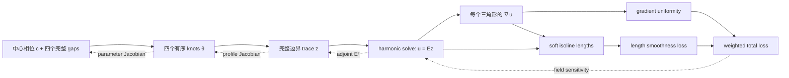
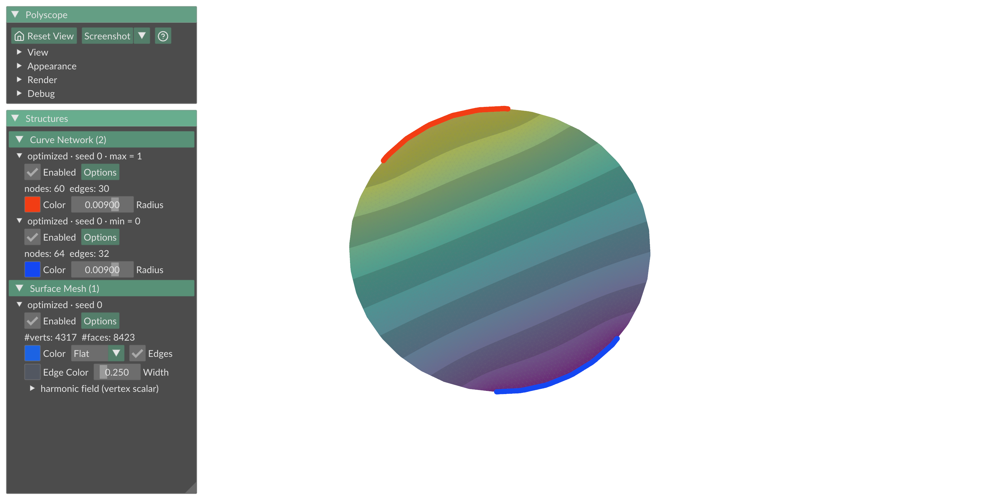
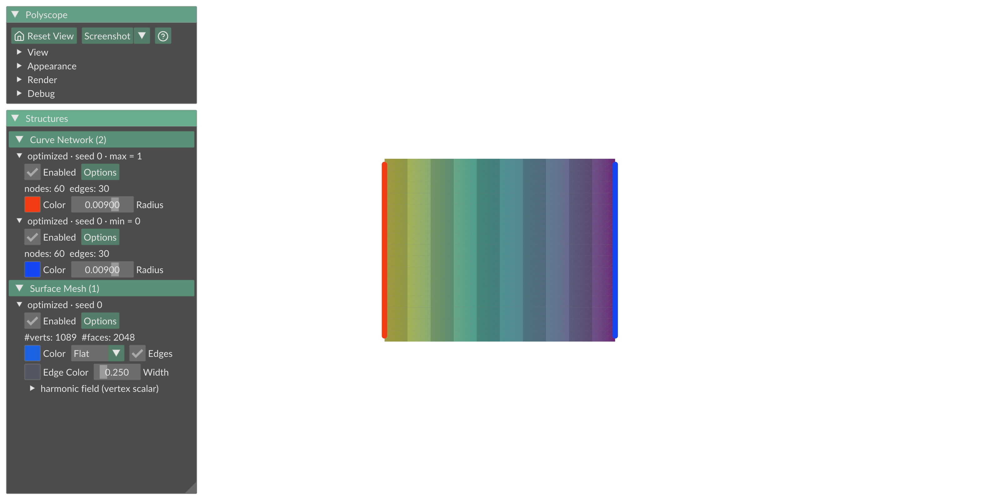

# 从零理解 Harmonic Boundary Optimization

本文解释当前 [`boundary_opt/`](boundary_opt/) package 中的完整线性边界版本。目标是：

> 用边界环上的四个连续端点定义一个完整的 \(0\to1\to0\) 分片线性边界函数，求它在
> 三角网格内部的 harmonic extension，再移动四个端点，让场的梯度尽量均匀。

整个问题可以压缩成三行：

\[
\boldsymbol z=h_{\boldsymbol\theta}(\boldsymbol\xi),
\qquad
\boldsymbol u=E\boldsymbol z,
\qquad
L=\operatorname{CV}_{A}^{2}\!\left(\lVert\nabla u\rVert^2\right).
\]

这里：

- \(\boldsymbol\theta=(\theta_0,\theta_1,\theta_2,\theta_3)\) 是真正有物理意义的四个
  boundary endpoints；
- \(\boldsymbol z\) 是所有边界顶点上的已知值；
- \(\boldsymbol u\) 是整个 mesh 上的 harmonic field；
- \(E\) 是 harmonic extension operator，代码只隐式应用它，不构造稠密矩阵；
- 外层优化使用四个独立自由度。实现为了对四个 gap 完全对称，保存五个坐标并施加一个
  线性等式。

---

## 1. 先分清四层变量

最容易混淆的是“端点”“边界值”和“内部场”。它们不是同一组未知量。

| 名称 | 存储数量 | 独立自由度 | 如何得到 |
|---|---:|---:|---|
| 优化状态 \(\boldsymbol p=(c,g_0,g_1,g_2,g_3)\) | 5 | 4 | 后端在约束集上更新 |
| 四个 knots \(\boldsymbol\theta\) | 4 | 4 | 由中心相位和 gaps 计算 |
| 边界 trace \(\boldsymbol z\) | 边界顶点数 \(B\) | 0 | 在边界顶点处采样 profile |
| harmonic field \(\boldsymbol u\) | 总顶点数 \(V\) | 0 | 每次通过固定线性系统求解 |

五个状态坐标满足

\[
g_i\ge\delta,
\qquad
\sum_{i=0}^{3}g_i=1.
\]

因此四个 gap 虽然全部显式存储，却只有三个独立自由度；再加一个中心相位 \(c\)，总共
仍然是四个自由度，也就是四个循环端点的自由度。



内部顶点值不是被 Adam 或其他高维优化器逐个更新的。给定四个 endpoints 后，它们由
harmonic 方程一次性确定。

---

## 2. 把任意边界环变成周期坐标轴

程序先找出 mesh 的唯一 manifold boundary loop，并按环上顺序排列边界顶点。设边界总
周长为 \(P\)，从选定起点沿边界走过的三维弧长为 \(s\)，定义

\[
\xi=\frac{s}{P}\in[0,1).
\]

也可以使用角度表示：

\[
\phi=2\pi\xi\in[0,2\pi).
\]

这里的 \(\phi\) 不是三维空间中的极角，只是归一化边界弧长。换句话说，Disk、Plane
或弯曲曲面都被统一摊成一条首尾相接的周期坐标轴。

对应实现分开放置：

- [`geometry/mesh.py`](geometry/mesh.py) 中的 `boundary_loop` 找出并排序边界环；
- [`boundary_opt/boundary.py`](boundary_opt/boundary.py) 中的 `boundary_arclength`
  用三维边长计算归一化累计弧长。

---

## 3. 四个 knots 定义了什么？

使用一组 unwrapped knots：

\[
\theta_0<\theta_1<\theta_2<\theta_3<\theta_0+1.
\]

它们把周期边界分成四段：

```text
theta0 ===== u=0 ===== theta1 ----- linear 0→1 ----- theta2
theta2 ===== u=1 ===== theta3 ----- linear 1→0 ----- theta0+1
```

四个循环 gaps 是

\[
\begin{aligned}
g_0&=\theta_1-\theta_0,\\
g_1&=\theta_2-\theta_1,\\
g_2&=\theta_3-\theta_2,\\
g_3&=\theta_0+1-\theta_3.
\end{aligned}
\]

其中 \(g_0\) 和 \(g_2\) 分别是 0 plateau 与 1 plateau 的宽度，\(g_1\) 与 \(g_3\)
是上升段和下降段的宽度。

令

\[
t=(\xi-\theta_0)\bmod 1,
\]

边界 profile 为

\[
h_{\boldsymbol\theta}(t)=
\begin{cases}
0,
&0\le t\le g_0,\\[3pt]
\dfrac{t-g_0}{g_1},
&g_0<t<g_0+g_1,\\[8pt]
1,
&g_0+g_1\le t\le g_0+g_1+g_2,\\[3pt]
1-\dfrac{t-g_0-g_1-g_2}{g_3},
&g_0+g_1+g_2<t<1.
\end{cases}
\]

因此：

- `min_curve` 是边界弧 \(\Gamma_0=[\theta_0,\theta_1]\)，理想 profile 上严格为 0；
- `max_curve` 是边界弧 \(\Gamma_1=[\theta_2,\theta_3]\)，理想 profile 上严格为 1；
- 内部的 \(u=q\), \(0<q<1\) 等值线由 harmonic solve 产生，不是另外四个设计变量。

profile 关于边界坐标是 \(C^0\) 分片线性的：值连续，四个 knots 处的斜率可以跳变。
实现是 [`cyclic_boundary_profile`](boundary_opt/boundary.py)。

### 3.1 不插入虚拟顶点时，端点怎样保持连续？

四个 knots 始终是 \([0,1)\) 上的浮点位置，不要求落在已有顶点上。实现只在原始边界
顶点 \(\xi_j\) 处采样

\[
z_j=h_{\boldsymbol\theta}(\xi_j),
\]

然后 mesh 的 P1 basis 在每条原始边上插值这些 nodal values。这样无需修改拓扑、无需
局部重三角化，矩阵结构也始终固定。

代价是：若 knot 位于一条原始边内部，该边上显示的离散 trace 由两个端点值线性插值得到，
不会在 knot 处出现一个精确折点。理想弧端点仍然是连续优化量，但“严格等于 0 或 1 的
离散曲线”只由两端采样值都等于目标值的完整 boundary edges 组成。网格细化后，这个采样
误差会随边界边长减小。

---

## 4. 完整 Dirichlet 边界条件

理想模型是

\[
\begin{cases}
\Delta u=0,&x\in\Omega,\\
u=h_{\boldsymbol\theta},&x\in\partial\Omega.
\end{cases}
\]

代码求解它的 boundary-vertex-sampled P1 离散版本：

\[
u_h(b_j)=h_{\boldsymbol\theta}(\xi_j),
\qquad
u_h|_{\partial\Omega}=I_hh_{\boldsymbol\theta},
\]

其中 \(I_h\) 是原始 boundary edge basis 的 nodal interpolation。整圈边界顶点值都由
profile 给定，state solve 只需要求内部顶点值。

这正是图形学中常见的 harmonic interpolation：指定一组边界 nodal values，其余顶点由
最小 Dirichlet energy 自动补全。这里的特别之处仅在于边界 nodal values 不是手工逐个
指定，而是由四个连续 endpoints 生成。

---

## 5. Harmonic field 为什么是一组线性方程？

Harmonic field 是 Dirichlet energy 的最小化器：

\[
\mathcal E(u)=\frac12\int_\Omega\lVert\nabla u\rVert^2\,dA.
\]

在三角形 P1 finite elements 中，

\[
\mathcal E(\boldsymbol u)=\frac12\boldsymbol u^TK\boldsymbol u,
\]

其中 \(K\) 是 cotangent stiffness matrix。将顶点重排成内部集合 \(I\) 和边界集合
\(B\)：

\[
K=
\begin{bmatrix}
K_{II}&K_{IB}\\
K_{BI}&K_{BB}
\end{bmatrix},
\qquad
\boldsymbol u=
\begin{bmatrix}
\boldsymbol u_I\\
\boldsymbol z
\end{bmatrix}.
\]

因为 \(\boldsymbol z\) 已知，只对 \(\boldsymbol u_I\) 极小化：

\[
K_{II}\boldsymbol u_I=-K_{IB}\boldsymbol z,
\qquad
\boldsymbol u_I=-K_{II}^{-1}K_{IB}\boldsymbol z.
\]

初始化时，代码组装一次 \(K\) 并对固定的 \(K_{II}\) 做一次稀疏 LU 分解。之后每次
objective evaluation 只更新右端项并回代，不会重新 factorize。

相关实现：

- [`boundary_opt/fem.py`](boundary_opt/fem.py) 中的 `cotangent_stiffness` 与
  `face_gradient_basis`；
- [`boundary_opt/harmonic.py`](boundary_opt/harmonic.py) 中的 `HarmonicField.solve`。

---

## 6. `u = Ez` 是数学简写，不是另一种算法

定义边界到全场的线性 operator

\[
E=
\begin{bmatrix}
-K_{II}^{-1}K_{IB}\\
I_B
\end{bmatrix},
\]

就有

\[
\boldsymbol u=E\boldsymbol z.
\]

显式形成 \(E\) 通常会得到一个大而稠密的矩阵，所以代码不保存它。`solve` 通过稀疏
回代隐式完成同一个线性映射，数值模型没有任何差别。

如果只关心边界能量，还可以写出 Schur complement

\[
S=K_{BB}-K_{BI}K_{II}^{-1}K_{IB},
\qquad
\mathcal E_D(\boldsymbol z)=\frac12\boldsymbol z^TS\boldsymbol z.
\]

不过当前 loss 需要每个 face 的 \(\nabla u\)，最终仍要恢复内部场，因此没有必要显式
构造 \(S\)。

---

## 7. 两个 loss 究竟测量什么？

P1 field 在每个三角形 \(f\) 内有常梯度。记

\[
\boldsymbol q_f=\nabla u|_f,
\qquad
r_f=\lVert\boldsymbol q_f\rVert^2,
\qquad
w_f=\frac{A_f}{\sum_jA_j}.
\]

定义

\[
\mu=\sum_fw_fr_f,
\qquad
m_2=\sum_fw_fr_f^2.
\]

当 \(\mu>0\) 时，uniformity loss 是

\[
L_{\mathrm{uniform}}
=\frac{m_2}{\mu^2}-1
=\frac{\operatorname{Var}_w(r)}{\mu^2}
=\operatorname{CV}_w^2(r).
\]

它有三个关键性质：

1. \(L_{\mathrm{uniform}}\ge0\)；
2. 所有 face 的非零 \(\lVert\nabla u\rVert\) 相同时，loss 等于 0；
3. 对 \(u\mapsto au+b\), \(a\ne0\)，loss 不变。

代码额外报告 `spacing_cv`，它是
\(\operatorname{CV}_w(\lVert\nabla u\rVert)\)，并不等于当前 loss 的平方根。实现位于
[`uniformity_loss_and_gradient`](boundary_opt/loss.py)。

### 7.1 为什么这与 isoline spacing 有关？

沿等值线法向移动一个小距离 \(d\ell\) 时，

\[
du\approx\lVert\nabla u\rVert\,d\ell.
\]

相邻等值 \(q\) 与 \(q+\Delta q\) 的局部间距近似为

\[
\Delta\ell\approx\frac{\Delta q}{\lVert\nabla u\rVert}.
\]

因此梯度模长越均匀，固定 value increment 的局部 isoline spacing 越均匀。但这仍是
proxy：它不直接测整条等值线之间的 geodesic distance，也不评价等值线形状和拓扑。

### 7.2 Soft isoline-length：直接比较等值线长度

真实等值线长度可以用 coarea identity 写成

\[
\ell(t)=\int_{\Gamma_t}ds
=\int_M\delta(u(x)-t)|\nabla u(x)|\,dA.
\]

实现中用宽度 \(\sigma=0.03\) 的 Gaussian 代替 Dirac delta，并在每个三角形内使用三个
barycentric quadrature points：

\[
\hat\ell(t_j)
=\frac{1}{c_j}\sum_f w_f|\nabla u_f|
\frac13\sum_{q=1}^3
\delta_\sigma(u_{fq}-t_j).
\]

其中 \(c_j\) 修正靠近 0 和 1 时 Gaussian 被值域截断的质量。相邻 course 长度的
smoothness loss 为

\[
L_{\mathrm{smooth}}
=\frac{
\frac1{m-1}\sum_{j=1}^{m-1}
\left[\frac{\hat\ell(t_{j+1})-\hat\ell(t_j)}
{t_{j+1}-t_j}\right]^2
}{\bar\ell^2+\varepsilon}.
\]

除以 level 间距后，它是归一化的离散 \(H^1\) seminorm，不会因为增加采样 levels
就自动变小。它惩罚相邻 knitting courses 突然变长或缩短，但不要求所有 courses
具有同一个绝对长度。

这不需要显式提取 contour；\(|\nabla u|\) 把窄带面积转换为曲线长度，因此直接估计
course 长度。实现位于
[`length_smoothness_loss_and_gradient`](boundary_opt/loss.py)。

### 7.3 Loss 自身不保证“从 0 到 1”

由于 scale invariance，几乎常值但相对均匀的场也可能得到很低的 CV loss。当前模型的
0 与 1 来自完整边界 profile，而不是 uniformity loss。

如果 0 plateau 和 1 plateau 内各有至少一个边界采样顶点，那么离散 Dirichlet data
确实包含 0 和 1。对很粗的边界，`minimum_gap` 只限制归一化弧长，并不自动保证 plateau
中存在顶点，因此应同时检查：

- `field.min()` 与 `field.max()`；
- 两个 plateau 上的完整 boundary edge 数量；
- mesh refinement 后结果是否稳定。

若整个离散场是常量，则 \(\mu=0\)，CV 是未定义的 \(0/0\)。公开的 loss 计算会抛出
`DegenerateFieldError`，不会把这个状态误报成零 loss。

---

## 8. 总目标

完整目标为：

\[
L=\lambda_{\mathrm{uniform}}L_{\mathrm{uniform}}
+\lambda_{\mathrm{smooth}}L_{\mathrm{smooth}}.
\]

默认值统一位于 `defaults.py`。两个权重只有相对比例影响优化路径：把它们同时乘以任意正数，
只会等比例缩放公开报告的 total loss 与 history，
不会改变 knots。实现中先除以最大权重，再组装 adjoint sensitivity，避免整体数值尺度泄漏
进 backend。

---

## 9. Exact adjoint gradient

整个前向链是

\[
\boldsymbol p
\longrightarrow\boldsymbol\theta
\longrightarrow\boldsymbol z
\longrightarrow\boldsymbol u=E\boldsymbol z
\longrightarrow L.
\]

### 9.1 从 face loss 到 vertex sensitivity

由

\[
L=\frac{m_2}{\mu^2}-1
\]

可得

\[
\frac{\partial L}{\partial r_f}
=\frac{2w_f}{\mu^2}
\left(r_f-\frac{m_2}{\mu}\right),
\]

进而

\[
\frac{\partial L}{\partial\boldsymbol q_f}
=\frac{4w_f}{\mu^2}
\left(r_f-\frac{m_2}{\mu}\right)\boldsymbol q_f.
\]

对三个 P1 basis gradients 做 transpose scatter，得到

\[
\boldsymbol s=\frac{\partial L}{\partial\boldsymbol u}
=
\begin{bmatrix}
\boldsymbol s_I\\
\boldsymbol s_B
\end{bmatrix}.
\]

总 field sensitivity 是

\[
\boldsymbol s
=\lambda_{\mathrm{uniform}}
\frac{\partial L_{\mathrm{uniform}}}{\partial\boldsymbol u}
+\lambda_{\mathrm{smooth}}
\frac{\partial L_{\mathrm{smooth}}}{\partial\boldsymbol u}.
\]

### 9.2 用一次 transpose solve 传回边界

边界扰动 \(d\boldsymbol z\) 引起

\[
d\boldsymbol u_I=-K_{II}^{-1}K_{IB}\,d\boldsymbol z.
\]

因此

\[
dL=
\left(
\boldsymbol s_B-K_{IB}^TK_{II}^{-T}\boldsymbol s_I
\right)^Td\boldsymbol z.
\]

先解

\[
K_{II}^T\boldsymbol\lambda=\boldsymbol s_I,
\]

再得到

\[
\frac{\partial L}{\partial\boldsymbol z}
=\boldsymbol s_B-K_{IB}^T\boldsymbol\lambda.
\]

最后用 chain rule：

\[
\nabla_{\boldsymbol p}L
=
\left(\frac{\partial\boldsymbol\theta}{\partial\boldsymbol p}\right)^T
\left(\frac{\partial\boldsymbol z}{\partial\boldsymbol\theta}\right)^T
\frac{\partial L}{\partial\boldsymbol z}.
\]

每次 objective + gradient 的主要成本是一遍 forward backsolve 和一遍 transpose
backsolve；两者复用同一份 LU factorization。`solve_adjoint` 位于
[`boundary_opt/harmonic.py`](boundary_opt/harmonic.py)，高层 chain rule 位于
[`boundary_opt/optimizer.py`](boundary_opt/optimizer.py)。

这套手写 adjoint 直接利用了固定线性系统，比对四个变量做 finite difference 更准确，
也不需要为了这个小型外层问题引入 autodiff runtime。

---

## 10. 中心相位 + 四个完整 gaps

优化状态是

\[
\boldsymbol p=(c,g_0,g_1,g_2,g_3),
\qquad
g_i\ge\delta,
\qquad
\sum_i g_i=1.
\]

其中 \(c\) 是四个 unwrapped knots 的平均值：

\[
c=\frac14\sum_{i=0}^3\theta_i\pmod 1.
\]

在可行 simplex 上，从状态到 knots 的映射为

\[
\begin{aligned}
\theta_0&=c-\tfrac34g_0-\tfrac12g_1-\tfrac14g_2,\\
\theta_1&=c+\tfrac14g_0-\tfrac12g_1-\tfrac14g_2,\\
\theta_2&=c+\tfrac14g_0+\tfrac12g_1-\tfrac14g_2,\\
\theta_3&=c+\tfrac14g_0+\tfrac12g_1+\tfrac34g_2.
\end{aligned}
\]

立刻可以验证：

\[
\theta_1-\theta_0=g_0,
\quad
\theta_2-\theta_1=g_1,
\quad
\theta_3-\theta_2=g_2,
\]

而等式约束给出

\[
\theta_0+1-\theta_3
=1-g_0-g_1-g_2
=g_3.
\]

公式中没有出现单独的 \(g_3\) 列，不代表 \(g_3\) 被特殊对待：它作为完整状态和完整
约束的一部分参与每一次投影或约束求解；在四维可行超平面上改变 \(g_3\)，必须同时改变
至少一个其他 gap，knots 因而随之变化。

这种坐标有三个好处：

1. 四个 gaps 全部显式存在，约束和投影对它们一视同仁；
2. \(c\) 是几何中心相位，不把任何一个 endpoint 选成特殊 origin；
3. 可行域是闭集，可以精确达到 \(g_i=\delta\) 的 active constraint。

相位保持为无约束实数，因为

\[
L(c+1,\boldsymbol g)=L(c,\boldsymbol g).
\]

只有公开输出与显示时才把相位或 knots canonicalize 到一个周期内，避免在 seam 上产生
假的 box boundary。

### 10.1 Euclidean simplex projection

SPG 以及公共工具函数使用

\[
\Pi_{\Delta_\delta}(\boldsymbol g)
=\arg\min_{\boldsymbol y}
\frac12\lVert\boldsymbol y-\boldsymbol g\rVert^2
\quad\text{s.t.}\quad
y_i\ge\delta,
\ \sum_i y_i=1.
\]

`project_gaps` 用标准 threshold 算法精确计算这个投影；`project_parameters` 只投影 gap
block，中心相位不变。实现位于 [`boundary_opt/simplex.py`](boundary_opt/simplex.py)。

### 10.2 SLSQP 试探点的对称延拓

SLSQP 会在等式约束附近评估 trial points。为使状态到 knots 的映射在这些点也有定义，
代码先把 trial gaps \(\widetilde{\boldsymbol g}\) 对称归一化到 simplex。令

\[
C=1-4\delta,
\qquad
a_i=\widetilde g_i-\delta,
\]

则在 bounds 内

\[
\widehat g_i
=\delta+C\frac{a_i}{\sum_j a_j}.
\]

当 \(\sum_i\widetilde g_i=1\) 时，\(\widehat{\boldsymbol g}=\widetilde{\boldsymbol g}\)；
离开等式超平面时，它为四个 gaps 提供完全对称的延拓。`knots_from_parameters` 同时返回
这个归一化的精确 Jacobian，因此传给 SLSQP 的仍是其实际 objective 的解析梯度。

---

## 11. 高层 optimizer 做了什么？

公共入口是：

```python
from boundary_opt import BoundaryOptimizer, random_knots
from geometry import load_obj

mesh = load_obj("data/disk.obj")
optimizer = BoundaryOptimizer(mesh)
initial_knots = random_knots(seed=0)

result = optimizer.optimize(
    initial_knots,
    backend="slsqp",
    max_iterations=240,
    seed=0,
)
```

将 `backend` 改为 `"spg"` 即可在完全相同的物理初值上切换算法。也可以一次运行两个：

```python
results = optimizer.optimize_backends(initial_knots, max_iterations=240, seed=0)
```

每次 loss evaluation 的物理部分完全相同：

1. 参数映射到 ordered knots 与 physical gaps；
2. 在原始 boundary vertices 上生成完整 trace；
3. 通过预分解的 \(K_{II}\) 求 harmonic field；
4. 计算 face gradients、loss 与 field sensitivity；
5. 用 adjoint 和 chain rule 得到参数梯度。

两个 backend 使用同一种 objective 接口。高层只 cache 重复 evaluation；backend 负责保存
它接受的可行 iterates。离散常量场会使原始 CV loss 未定义，此时直接抛出
`DegenerateFieldError`。如果 backend 没有收敛，`optimize` 直接抛出 `RuntimeError`，不会换用
恢复起点、惩罚 surrogate 或中途出现过的最低 loss。

返回的 `OptimizationResult` 包含：

- `knots`、`gaps`、`field` 和最终 loss 分解；
- `history` 与对应的 `parameter_history`；
- backend 名称、迭代数和 evaluation 数；
- `kkt_residual` 与 `constraint_violation`。

只有 backend 成功收敛才会产生 `OptimizationResult`。

---

## 12. SLSQP backend

SLSQP 直接求解

\[
\min_{c,\boldsymbol g}L(c,\boldsymbol g)
\quad\text{s.t.}\quad
g_i\ge\delta,
\quad
\boldsymbol 1^T\boldsymbol g=1.
\]

实现 [`boundary_opt/slsqp_backend.py`](boundary_opt/slsqp_backend.py) 将约束交给 SciPy：

- center 的 bounds 为 \(({-}\infty,+\infty)\)；
- 四个 gaps 各有 lower bound \(\delta\)；
- 一个 `LinearConstraint` 精确表达 \(\sum_i g_i=1\)；
- objective 同时返回 loss 和 exact gradient；
- 传给 SciPy 的 loss 和 gradient 同除以初始 loss，使初始数值目标为 1；
- callback 只记录可行的 iterates。

SLSQP 每一步建立局部 quadratic subproblem，并用 merit-function line search 协调目标与
约束。它的 history 不保证 loss 严格单调；这不是 bug，而是约束优化 line search 的正常
行为。

当前默认 backend 是 `"slsqp"`。它适合这个低维、带简单线性约束、已有精确梯度的问题。
不过 SLSQP 的 `success=True` 只说明它满足自己的局部终止条件，不构成全局最优证明。

---

## 13. SPG backend：BB1 + nonmonotone Armijo

SPG 是 spectral projected gradient。它只需要 objective gradient 和 simplex projection，
不建立 quadratic subproblem。

### 13.1 Projected direction

给定当前状态 \(\boldsymbol p_k\)、gradient \(\nabla L_k\) 和 spectral scale
\(\alpha_k\)，先算

\[
\boldsymbol d_k
=\Pi\!\left(\boldsymbol p_k-\alpha_k\nabla L_k\right)
-\boldsymbol p_k,
\]

其中 \(\Pi\) 只投影 gap block。若未达到约束驻点，通常有

\[
\nabla L_k^T\boldsymbol d_k<0.
\]

trial state 使用

\[
\boldsymbol p_k(t)=\Pi(\boldsymbol p_k+t\boldsymbol d_k),
\]

所以每个被接受状态都保持可行。

### 13.2 Nonmonotone Armijo line search

普通 monotone line search 要求每一步都低于上一点，可能对弯曲狭长的 basin 过于保守。
当前实现使用最近十个 accepted losses 的最大值作为 reference：

\[
L_{\mathrm{ref}}
=\max\{L_{k-j}:0\le j<10\}.
\]

接受条件是

\[
L(\boldsymbol p_k(t))
\le
L_{\mathrm{ref}}
+10^{-4}t\,\nabla L_k^T\boldsymbol d_k.
\]

若不满足，就令 \(t\leftarrow t/2\) 并重试。因为 reference 不是只取当前 loss，单步可以
小幅上升，但最近窗口的上界受到控制；这种非单调性常能减少狭窄区域中的无谓回溯。

### 13.3 BB1 spectral step

接受新点后，令

\[
\boldsymbol s_k=\boldsymbol p_{k+1}-\boldsymbol p_k,
\qquad
\boldsymbol y_k=\nabla L_{k+1}-\nabla L_k.
\]

若 \(\boldsymbol s_k^T\boldsymbol y_k>0\)，BB1 scale 是

\[
\alpha_{k+1}
=\frac{\boldsymbol s_k^T\boldsymbol s_k}
{\boldsymbol s_k^T\boldsymbol y_k},
\]

再截断到实现允许的稳定区间。它用一个标量近似 inverse curvature，通常比固定 learning
rate 更适合不同 mesh 和不同局部尺度。曲率信息不可靠时，代码退回安全的最大 scale。

### 13.4 终止条件

SPG 使用 unit-step projected-gradient mapping：

\[
r_{\mathrm{PG}}
=\left\|
\boldsymbol p-\Pi(\boldsymbol p-\nabla L)
\right\|_\infty.
\]

它同时检测 center gradient 和 gap simplex 的约束驻点条件。active constraint 上 raw
gradient 不必为零，因此这个量比普通 gradient norm 更有解释力。实现位于
[`boundary_opt/spg_backend.py`](boundary_opt/spg_backend.py)。

---

## 14. 两个 backend 怎样选择？

两个 backend 优化同一个目标、使用同一套参数、相同 adjoint gradient 和相同高层结果
筛选。区别只在 outer step 如何产生。

| 方面 | SLSQP | SPG |
|---|---|---|
| 约束处理 | bounds + 线性等式 | 每一步 Euclidean projection |
| 局部尺度 | quadratic subproblem | BB1 scalar spectral scale |
| line search | SciPy merit-function | 最近窗口的 Armijo reference |
| accepted states | 可能经约束恢复后接受 | 天然保持在 simplex 上 |
| 特点 | 低维约束问题中通常很高效 | 结构透明、实现小、容易检查 |
| 保证 | 局部终止 | 局部 projected stationarity |

建议把 SLSQP 作为默认结果，把 SPG 作为独立实现和交叉检查。如果两者从同一初值收敛到
相近的 physical knots、loss 和小 projected-gradient residual，可信度会更高；若结果
不同，说明它们可能进入了不同 basin，需要增加随机种子或检查 active constraints。

二者都是局部优化器，都不能仅凭一次运行证明找到了 global minimum。

---

## 15. 用 Disk 理解优化结果

Disk 的边界接近旋转对称。若离散网格也足够均匀，一个自然的低-loss 结构通常具有：

- 0 plateau 与 1 plateau 宽度接近；
- 上升段与下降段宽度接近；
- 两组弧大致相隔半圈；
- 内部 isolines 近似平行、间距比较均匀。
- 相邻 value bands 的面积更均匀，抑制 isoline 长度忽长忽短。

这些只是几何对称性对最优解的提示，不是代码写入的 symmetry constraint。三角剖分、边界
采样、初值和局部 basin 都可能造成轻微不对称。



读图时要分清两件事：边界上标出的 0/1 arcs 是优化出来的两个 plateaus；mesh 内部彩色
等值线是对应边界 trace 的 harmonic extension。它们共同由最终四个 knots 决定，但内部
等值线不是显式设计曲线。

不要把某次保存图片中的数值当成固定 benchmark。更可靠的做法是用同一 mesh、同一参数
分别扫描两个 backend，比较 loss 分布、constraint violation、projected-gradient residual
和最终 gaps。复现命令见第 18 节。

---

## 16. 为什么 Plane 四角是连续模型的全局最优？

下面的证明要求：

- mesh 的外边界是矩形，四个角是边界顶点；
- 每条边的归一化长度都不小于 `minimum_gap`。

考虑矩形

\[
\Omega=[x_{\min},x_{\min}+W]\times[y_{\min},y_{\min}+H].
\]

令 0 plateau 位于左边，1 plateau 位于右边；一条水平边从 0 线性上升到 1，另一条水平边
从 1 线性下降到 0。也就是把四个 knots 放在四个角上，并选择匹配这个方向的循环标号。

解析函数

\[
u(x,y)=\frac{x-x_{\min}}{W}
\]

满足

\[
\Delta u=0,
\qquad
u|_{\partial\Omega}=h_{\boldsymbol\theta},
\qquad
\lVert\nabla u\rVert=\frac1W.
\]

P1 finite elements 可以精确表示 affine function。因此不论矩形内部如何进行合法三角剖分，
只要使用对应 nodal Dirichlet data，离散 harmonic solve 都恢复同一个 affine field；每个
face 的梯度完全相同，于是

\[
L_{\mathrm{uniform}}=0.
\]

每条内部等值线都是等长直线，所以

\[
L_{\mathrm{smooth}}=0.
\]

两个 loss 都非负，因此四角解是连续模型的 global optimum。离散 length smoothness loss
使用三点 triangle quadrature；当前 Plane 四角场上的 raw loss 约为
\(4.5\times10^{-9}\)。



这个证明说明“最优解是什么”，但不说明任意局部算法从任意随机初值都能到达它。SLSQP
和 SPG 仍可能停在其他 stationary point 或 minimum-gap active face。判断实现是否健康时，
应至少做三类检查：

1. 直接把理论四角 knots 输入 `loss_and_knot_gradient`，验证 uniformity loss 接近零、
   length smoothness loss 接近 quadrature 精度；
2. 从四角附近扰动初值，验证两个 backend 能回到该 basin；
3. 扫描随机 seeds，区分“理论解不存在”“离散实现错误”和“局部优化没有进入正确 basin”。

若第一项失败，应优先检查 boundary ordering、角点位置、profile orientation、cotangent
operator 和 mesh 几何；这时不能把问题归因于局部优化器。

---

## 17. 可微性、驻点与已知限制

当每个 boundary vertex 固定处于 profile 的同一分段，并且 \(\mu>0\) 时：

- centered phase/full-gap 到 knots 的映射有解析 Jacobian；
- boundary samples 对 knots 解析可微；
- \(\boldsymbol u=E\boldsymbol z\) 是固定线性映射；
- face gradients、loss 和 adjoint gradient 都可微。

但 knot 穿过一个原始 boundary vertex 时，该顶点会切换 profile branch。函数值仍然连续，
参数导数通常会跳变。因此更准确的说法是：

> 离散 objective 在固定 boundary-profile cell 内解析可微，整体连续且分片光滑，但不是
> 全局 \(C^1\) 目标。

simplex projection 在 active set 改变时也不是处处光滑；SPG 只需要执行投影，不需要对
整个优化轨迹反向传播。

当前实现的主要限制是：

1. **完整 profile 被规定**：四个 endpoints 决定包括两段斜坡在内的整圈 trace。
2. **没有 edge 内精确 breakpoint**：连续 knot 只通过原 boundary-vertex samples 影响场。
3. **Loss 仍是 proxy**：soft isoline loss 估计长度，但不显式提取 contour 的形状或拓扑。
4. **Scale invariance**：0 到 1 由 boundary data 保证，不由 CV loss 推出。
5. **局部优化**：SLSQP 与 SPG 都可能收敛到非全局 basin。
6. **Active constraints**：达到 \(g_i=\delta\) 可以是合法 KKT 点，也可能是不理想的局部点。
7. **Loss 权重改变问题**：整体缩放不改变解，但改变权重比例就是不同的数学目标，不能把
   两者的 total loss 直接比较。
8. **Maximum principle 的离散条件**：一般非 Delaunay cotangent mesh 可能轻微 overshoot，
   应实际报告 field range。
9. **拓扑限制**：当前只接受一个 manifold boundary loop，且必须存在 interior vertices。
10. **分辨率依赖**：边界采样、face moments 与最优 knots 可能随 refinement 改变。

---

## 18. 代码地图与复现命令

### 18.1 文件职责

| 文件 | 职责 |
|---|---|
| [`geometry/mesh.py`](geometry/mesh.py) | 共享 Mesh、OBJ I/O、尺度归一化与边界环 |
| [`boundary_opt/defaults.py`](boundary_opt/defaults.py) | 所有 public 默认参数的唯一来源 |
| [`boundary_opt/fem.py`](boundary_opt/fem.py) | cotangent stiffness 与三角形面梯度 |
| [`boundary_opt/harmonic.py`](boundary_opt/harmonic.py) | harmonic 预分解、正向求解与 adjoint |
| [`boundary_opt/boundary.py`](boundary_opt/boundary.py) | 边界弧长、knots、gaps、profile 与 center/full-gap 转换 |
| [`boundary_opt/simplex.py`](boundary_opt/simplex.py) | closed simplex、projection 与 KKT residual |
| [`boundary_opt/loss.py`](boundary_opt/loss.py) | gradient uniformity、soft isoline-length smoothness 与场统计 |
| [`boundary_opt/optimizer.py`](boundary_opt/optimizer.py) | objective、evaluation cache、结果与 backend dispatch |
| [`boundary_opt/slsqp_backend.py`](boundary_opt/slsqp_backend.py) | exact-gradient constrained SLSQP |
| [`boundary_opt/spg_backend.py`](boundary_opt/spg_backend.py) | BB1 SPG 与 nonmonotone Armijo |
| [`boundary_opt/__init__.py`](boundary_opt/__init__.py) | 稳定的 public API |
| [`scan_mesh_seeds.py`](scan_mesh_seeds.py) | 随机种子扫描与 CSV history |
| [`plot_loss_curves.py`](plot_loss_curves.py) | 从 history CSV 生成 loss curves |
| [`visualize_mesh_optimization.py`](visualize_mesh_optimization.py) | Polyscope 最终场、前后图与动画 |

### 18.2 运行全部测试

```bash
uv run pytest
```

测试应覆盖 boundary profile Jacobian、FEM energy、`solve`/`solve_adjoint` transpose
identity、完整参数 gradient、simplex projection、两个 backend 和 Plane affine 解。

### 18.3 在 Disk 上分别扫描两个 backend

```bash
uv run scan_mesh_seeds.py \
  --mesh disk \
  --backend slsqp \
  --seeds 16 \
  --iterations 240

uv run scan_mesh_seeds.py \
  --mesh disk \
  --backend spg \
  --seeds 16 \
  --iterations 240
```

默认输出分别写到 backend-specific CSV，避免互相覆盖。

### 18.4 扫描 Plane 与 Triple Peak

```bash
uv run scan_mesh_seeds.py \
  --mesh plane \
  --backend slsqp \
  --seeds 16 \
  --iterations 240

uv run scan_mesh_seeds.py \
  --mesh triple_peak \
  --backend spg \
  --seeds 16 \
  --iterations 240
```

### 18.5 画两个 backend 的 Disk loss curves

```bash
uv run plot_loss_curves.py \
  --history "Disk · SLSQP" output/disk_slsqp_seed_scan_history.csv \
  --history "Disk · SPG" output/disk_spg_seed_scan_history.csv \
  --title "Disk · centered full-gap backends" \
  --svg output/disk_backend_loss_curves.svg
```

history 是 accepted feasible iterates，不是每一次内部 objective evaluation。曲线允许局部
上升；最终点与返回结果保持一致。

### 18.6 打开标准 Polyscope panel，只看最终 Disk

```bash
uv run visualize_mesh_optimization.py
```

加上 `--backend spg` 即可查看另一后端；加上 `--screenshot-only` 会保存截图后退出。

### 18.7 播放优化动画

```bash
uv run visualize_mesh_optimization.py \
  --mesh disk \
  --backend spg \
  --seed 0 \
  --iterations 240 \
  --animate \
  --fps 8
```

动画播放的是 `parameter_history` 中保存的可行 states，并保证最后一帧对应返回场。

### 18.8 查看 Plane 最终结果

```bash
uv run visualize_mesh_optimization.py --mesh plane
```

---

## 19. 最后一张公式卡

边界坐标与约束：

\[
\boxed{
\boldsymbol p=(c,g_0,g_1,g_2,g_3),
\qquad
g_i\ge\delta,
\qquad
\sum_i g_i=1
}
\]

五个存储坐标、一个等式，所以是四个独立自由度。

前向：

\[
\boxed{
\boldsymbol z=h_{\boldsymbol\theta(\boldsymbol p)}(\boldsymbol\xi),
\qquad
\boldsymbol u=E\boldsymbol z,
\qquad
L=\lambda_{\mathrm{uniform}}
\operatorname{CV}_{A}^{2}(\lVert\nabla u\rVert^2)
+\lambda_{\mathrm{smooth}}L_{\mathrm{smooth}}
}
\]

伴随：

\[
\boxed{
K_{II}^{T}\boldsymbol\lambda=\boldsymbol s_I,
\qquad
E^T\boldsymbol s
=\boldsymbol s_B-K_{IB}^T\boldsymbol\lambda
}
\]

完整 chain rule：

\[
\boxed{
\nabla_{\boldsymbol p}L
=
\left(\frac{\partial\boldsymbol\theta}{\partial\boldsymbol p}\right)^T
\left(\frac{\partial\boldsymbol z}{\partial\boldsymbol\theta}\right)^T
E^T\nabla_{\boldsymbol u}L
}
\]

约束驻点诊断：

\[
\boxed{
r_{\mathrm{PG}}
=\left\|
\boldsymbol p-\Pi(\boldsymbol p-\nabla L)
\right\|_\infty
}
\]

这套实现最核心的简洁性来自三点：四个 endpoints 始终是连续设计量；高维 field 始终由
固定 harmonic operator 精确消去；两个可互换 backend 共享同一套解析 adjoint gradient
和同一个完整 gap simplex。
