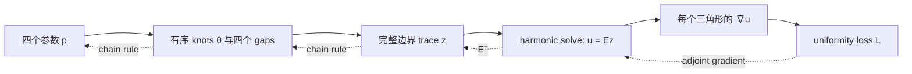
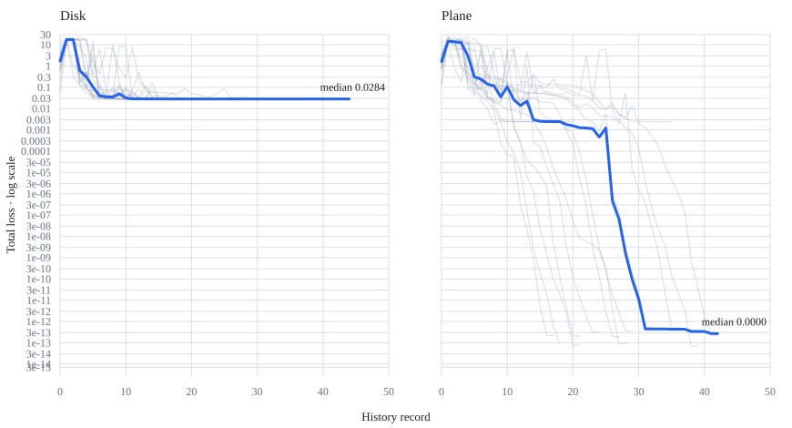

# 从零理解线性全边界 Harmonic Boundary Optimization

本文只解释 [`boundary_opt.py`](boundary_opt.py) 中保留的 **linear
all-boundary Dirichlet** 版本。它和
[`continuous_partial_opt.py`](continuous_partial_opt.py) 的 partial-Dirichlet / Wentzell
版本是两个不同的数学模型，不要混在一起理解或直接比较实现细节。

如果只记一句话，可以记住：

> 四个连续参数先规定整条边界上的完整 \(0\to1\to0\) 分片线性函数，再对内部顶点做
> harmonic extension；优化器通过解析伴随梯度移动这四个参数，使网格内部的场梯度尽量
> 均匀。

它最简洁的数学摘要是

\[
\boldsymbol z=g(\boldsymbol\theta(\boldsymbol p)),\qquad
\boldsymbol u=E\boldsymbol z,\qquad
L=\operatorname{CV}_{A}^{2}\!\left(\lVert\nabla u\rVert^2\right).
\]

这里：

- \(\boldsymbol p\in\mathbb R^4\) 是真正交给优化器的四个变量；
- \(\boldsymbol\theta\) 是边界环上的四个有序 knots；
- \(\boldsymbol z\) 是所有边界顶点的已知 Dirichlet 值；
- \(\boldsymbol u\) 是整个 mesh 上由线性方程自动求出的 harmonic field；
- \(E\) 是 harmonic extension operator，代码不会显式构造这个大矩阵。

---

## 1. 首先区分“设计变量”“边界值”和“场”

这三个概念很容易混淆：

| 名称 | 数量 | 是否被外层直接优化 | 来源 |
|---|---:|---|---|
| 参数 \(\boldsymbol p=(o,g_0,g_1,g_2)\) | 4 | 是 | constrained SLSQP |
| knots \(\boldsymbol\theta\) | 4 | 间接 | 由 offset 与累计 gaps 得到 |
| 边界 trace \(\boldsymbol z\) | 边界顶点数 \(B\) | 否 | 由四个 knots 的分片线性 profile 生成 |
| harmonic field \(\boldsymbol u\) | 总顶点数 \(V\) | 否 | 每次通过线性系统求解 |

虽然最后有几千个甚至更多的 \(u_i\)，外层问题始终只有四维。内部场不是通过 Adam
逐个更新出来的，而是给定四个参数后一次性解出来的。



---

## 2. 把一圈边界变成一条周期坐标轴

程序首先找出 mesh 唯一的 manifold boundary loop，并按照环上的顺序排列边界顶点。
设边界总周长为 \(P\)，从起点沿边界走过的物理弧长为 \(s\)，定义归一化弧长

\[
\xi=\frac{s}{P}\in[0,1).
\]

也可以把它显示成角度

\[
\phi=2\pi\xi\in[0,2\pi).
\]

这里的 \(\phi\) **不是 mesh 在三维空间中的极角**。它只是把任意形状的一圈边界
摊成一个周期为 1 或 \(2\pi\) 的坐标轴，所以同样适用于 Disk、Plane 和弯曲的
Triple Peak。

对应代码是：

- [`boundary_loop`](boundary_opt.py#L103)：找到唯一边界环；
- [`boundary_arclength`](boundary_opt.py#L144)：计算三维边长和归一化累计弧长。

---

## 3. 四个 knots 到底定义了什么？

令四个连续 knots 满足

\[
\theta_0<\theta_1<\theta_2<\theta_3<\theta_0+1.
\]

它们把周期边界分成四段：

```text
theta0 ===== u=0 ===== theta1 ----- linear 0→1 ----- theta2
theta2 ===== u=1 ===== theta3 ----- linear 1→0 ----- theta0+1
```

设最小 gap 为 \(\delta\)，当前默认值是 `0.03`。四个循环 gaps 满足

\[
\begin{aligned}
g_0&=\theta_1-\theta_0,\\
g_1&=\theta_2-\theta_1,\\
g_2&=\theta_3-\theta_2,\\
g_3&=\theta_0+1-\theta_3,
\end{aligned}
\qquad
g_i\ge\delta,\qquad \sum_i g_i=1.
\]

取局部周期坐标

\[
t=(\xi-\theta_0)\bmod 1,
\]

完整边界 profile 为

\[
g_{\boldsymbol\theta}(t)=
\begin{cases}
0,
&0\le t\le g_0,\\[3pt]
\dfrac{t-g_0}{g_1},
&g_0<t<g_0+g_1,\\[8pt]
1,
&g_0+g_1\le t\le g_0+g_1+g_2,\\[3pt]
1-\dfrac{t-g_0-g_1-g_2}{g_3},
&g_0+g_1+g_2<t<1.
\end{cases}
\]

因此，在理想的连续设计 profile 上：

- \(\Gamma_0=[\theta_0,\theta_1]\) 是理想的 \(u=0\) plateau；
- \(\Gamma_1=[\theta_2,\theta_3]\) 是理想的 \(u=1\) plateau；
- 另外两段不是 free boundary，而是预先规定好的弧长线性 transition。

实现位于 [`cyclic_boundary_profile`](boundary_opt.py#L154)。

这个 profile 关于边界坐标是 \(C^0\) 分片线性的：函数值连续，但在四个 knots 处斜率
跳变，所以它不是 \(C^1\)，更不是 \(C^2\)。

### 3.1 `min_curve` 和 `max_curve` 是不是优化出来的 curve？

四个参数优化的是理想 profile 中 \(\Gamma_0\) 和 \(\Gamma_1\) 的连续端点，所以从
设计语义上说，这两段 boundary arcs 是优化结果。但当前离散 mesh 只在原始顶点采样：
离散的 exact plateau 由端点值都严格为 0 或 1 的完整 boundary edges 组成，通常不会
精确终止在一个落于 edge 内部的 knot。只有 knot 与原始顶点对齐时，理想 curve 和
离散 curve 才完全一致。

内部的 \(u=c\), \(0<c<1\) isolines 是 harmonic solve 的结果，不是额外优化的显式
折线。

### 3.2 一个重要的离散细节

四个 knots 是连续的 \([0,1)\) 坐标，但当前线性版本**不插入虚拟顶点**。代码只在
原始 boundary vertices 的 \(\xi_j\) 上采样

\[
z_j=g_{\boldsymbol\theta}(\xi_j).
\]

mesh 随后在每条原始边上做普通 P1 插值。因此，如果 knot 落在一条边的内部，显示出来
的离散 trace 不会在 knot 处拥有一个精确 breakpoint；它只是由该边两端采样值决定的
整边线性函数。knot 与原始顶点重合时则可以精确表达 breakpoint。

这是“不增加顶点”的简洁代价，也是它和 continuous partial 版本局部 cut assembly 的
关键区别。

---

## 4. 这不是 partial Dirichlet / Neumann 问题

线性版本的理想连续模型可以写成

\[
\begin{cases}
\Delta u=0,&x\in\Omega,\\
u=g_{\boldsymbol\theta},&x\in\partial\Omega.
\end{cases}
\]

当前代码实际求解的是它的 boundary-vertex-sampled P1 离散版本：

\[
u_h(b_j)=g_{\boldsymbol\theta}(\xi_j),
\qquad
u_h|_{\partial\Omega}=I_hg_{\boldsymbol\theta},
\]

其中 \(I_h\) 表示由原始 boundary edge basis 做的 nodal interpolation。也就是说，
理想 profile 的第二行作用于整条连续边界，而实现固定整圈 boundary nodal values；当
knot 位于 edge 内部时，两者存在上一节说明的采样差异。

两段 plateau samples 和两段 transition samples 全部是已知 Dirichlet data，所以边界
顶点不会参与 state solve，也不会自动产生 \(\partial_\nu u=0\) 的 natural Neumann
condition。

两种模型的最小区别可以写成：

```text
linear all-boundary:
    全部 u_B = z(theta) 已知，只求 interior u_I

partial Dirichlet:
    只有 Gamma0/Gamma1 已知，其余 boundary values 和 interior 一起求
```

所以线性版本表现好，不能解释成“PDE 自动找到了线性 transition”。这里的 transition
本来就是模型输入的一部分。

---

## 5. Harmonic field 为什么是一组线性方程？

Harmonic field 是 Dirichlet energy 的最小化器：

\[
\mathcal E(u)=\frac12\int_\Omega \lVert\nabla u\rVert^2\,dA.
\]

使用三角形 P1 finite elements 离散后，能量写成

\[
\mathcal E(\boldsymbol u)=\frac12\boldsymbol u^TK\boldsymbol u,
\]

其中 \(K\) 是 cotangent stiffness matrix。把顶点重排成内部集合 \(I\) 和边界集合
\(B\)：

\[
K=
\begin{bmatrix}
K_{II}&K_{IB}\\
K_{BI}&K_{BB}
\end{bmatrix},
\qquad
\boldsymbol u=
\begin{bmatrix}
\boldsymbol u_I\\
\boldsymbol z
\end{bmatrix}.
\]

因为 \(\boldsymbol z\) 已知，只对 \(\boldsymbol u_I\) 求极小值：

\[
\frac{\partial\mathcal E}{\partial\boldsymbol u_I}
=K_{II}\boldsymbol u_I+K_{IB}\boldsymbol z=0.
\]

于是

\[
K_{II}\boldsymbol u_I=-K_{IB}\boldsymbol z,
\qquad
\boldsymbol u_I=-K_{II}^{-1}K_{IB}\boldsymbol z.
\]

这就是“给定任意 boundary condition，内部自动求出来”的离散版本。

对应实现：

- [`cotangent_stiffness`](boundary_opt.py#L246)：组装 \(K\)；
- [`HarmonicBoundaryOptimizer.__init__`](boundary_opt.py#L303)：提取固定 block 并分解
  \(K_{II}\)；
- [`extend`](boundary_opt.py#L360)：执行一次 harmonic extension。

---

## 6. `u = Ez` 到底是什么意思？

将边界到全场的线性映射记成

\[
E=
\begin{bmatrix}
-K_{II}^{-1}K_{IB}\\
I_B
\end{bmatrix},
\]

就得到

\[
\boldsymbol u=E\boldsymbol z.
\]

这不是另一种近似，也没有改变结果；它只是把“解一次 Dirichlet problem”写成一个线性
operator。数学上显式形成 \(E\) 很漂亮，但 \(E\) 通常是大而稠密的，代码没有必要
真的保存它。

当前实现采用更省内存的隐式形式：

1. 初始化时稀疏 LU 分解 \(K_{II}\) 一次；
2. 每次参数变化，只重新生成很小的 boundary vector \(\boldsymbol z\)；
3. 计算右端项 \(-K_{IB}\boldsymbol z\)；
4. 用同一份 LU factors 回代得到 \(\boldsymbol u_I\)。

因此 `u=Ez` 与当前代码的数值结果没有差距。它是对现有 solve 的数学概括，而不是建议
额外构造一个 dense matrix。

### 6.1 可选的 Schur complement 视角

把内部解代回能量可得纯边界能量

\[
\mathcal E_D(\boldsymbol z)=\frac12\boldsymbol z^TS\boldsymbol z,
\]

其中

\[
S=K_{BB}-K_{BI}K_{II}^{-1}K_{IB}.
\]

\(S\) 可以理解为离散 Dirichlet-to-Neumann / Steklov operator。不过当前 outer loss
需要每个三角形上的 \(\nabla u\)，所以最终仍要得到内部场；实现不需要显式形成 \(S\)。

---

## 7. Loss 在测量什么？

对每个三角形 \(f\)，P1 field 的梯度在该三角形内是常量：

\[
\boldsymbol g_f=\nabla u|_f,
\qquad
r_f=\lVert\boldsymbol g_f\rVert^2.
\]

用面积归一化权重

\[
w_f=\frac{A_f}{\sum_jA_j},
\qquad
\sum_fw_f=1,
\]

定义

\[
\mu=\sum_fw_fr_f,
\qquad
m_2=\sum_fw_fr_f^2.
\]

当 \(\mu>0\) 时，当前 uniformity loss 是

\[
L_{\mathrm{uniform}}
=\frac{m_2}{\mu^2}-1
=\frac{\operatorname{Var}_w(r)}{\mu^2}
=\operatorname{CV}_w^2(r).
\]

它有三个直接性质：

1. \(L\ge0\)；
2. 当所有三角形的非零 \(\lVert\nabla u\rVert\) 相同时，\(L=0\)；
3. 把整个场乘以非零常数不会改变 loss，加上常数偏移也不会改变 loss。

若整个场的梯度全部为零，则 \(\mu=0\)，CV 是未定义的 `0/0`；当前实现会明确拒绝
这个状态，而不是把它记作零 loss。

实现位于 [`_loss_and_field_gradient`](boundary_opt.py#L387)。

程序另外报告的 `spacing_cv` 是
\(\operatorname{CV}_w(\lVert\nabla u\rVert)\)，而优化的 loss 是
\(\operatorname{CV}_w^2(\lVert\nabla u\rVert^2)\)。二者在完全均匀时都为 0，但数值上
不满足 `spacing_cv² == loss`；后者对大梯度 face 更敏感。

### 7.1 为什么梯度均匀和 isoline 间距有关？

沿 isoline 法向移动一个很小距离 \(d\ell\) 时，场值变化近似为

\[
du\approx\lVert\nabla u\rVert\,d\ell.
\]

所以相邻等值 \(c\) 和 \(c+\Delta c\) 的局部距离近似为

\[
\Delta\ell\approx\frac{\Delta c}{\lVert\nabla u\rVert}.
\]

固定 \(\Delta c\) 后，\(\lVert\nabla u\rVert\) 越均匀，局部 isoline spacing 越均匀。

但它仍然只是 proxy：loss 不直接测量整条等值线之间的真实 geodesic distance，也不评价
等值线是否笔直、是否具有期望拓扑。

### 7.2 这个 loss 本身仍然不保证幅度为 0 到 1

这是一个重要的数学事实：CV loss 对整体 scale 不敏感，一个几乎常数但梯度相对均匀的
场也可能得到低 loss。

线性版本之所以通常能得到 \(0\to1\)，不是因为 loss，而是因为**完整 Dirichlet trace
已经把 plateau 规定成 0 和 1**。在当前细分足够密的 Disk 和 Plane 上，plateau 内都有
边界顶点，因此离散边界确实取得 0 和 1。

对于非常粗糙的边界，`minimum_gap` 并不自动证明每个 plateau 内一定存在采样顶点；应当
额外检查 `field.min()`、`field.max()` 和 plateau vertex count。

---

## 8. 可选的 plateau width prior

默认目标只有 uniformity loss。若希望 0/1 plateau 接近指定归一化宽度 \(a\)，可以加

\[
L_{\mathrm{width}}
=\omega\left[
\left(\frac{g_0-a}{a}\right)^2
+\left(\frac{g_2-a}{a}\right)^2
\right].
\]

总目标为

\[
L=L_{\mathrm{uniform}}+L_{\mathrm{width}}.
\]

对应命令行参数是：

- `--target-arc-width a`；
- `--width-weight omega`。

默认 `width_weight=0`，即不使用该 prior。开启 prior 会改变原本的数学最优问题，因此
不应把有 prior 和无 prior 的 loss 当成同一个 benchmark。实现位于
[`_width_loss_and_gradient`](boundary_opt.py#L425)。

---

## 9. 为什么不需要 finite difference 或 autodiff？

整个前向链条是

\[
\boldsymbol p
\longrightarrow\boldsymbol\theta
\longrightarrow\boldsymbol z
\longrightarrow\boldsymbol u=E\boldsymbol z
\longrightarrow L.
\]

先补齐从 face loss 到 vertex sensitivity 的一步。记
\(\boldsymbol g_f=\nabla u|_f\) 和
\(r_f=\boldsymbol g_f^T\boldsymbol g_f\)，则

\[
\frac{\partial L}{\partial r_f}
=\frac{2w_f}{\mu^2}
\left(r_f-\frac{m_2}{\mu}\right),
\]

因此

\[
\frac{\partial L}{\partial\boldsymbol g_f}
=\frac{4w_f}{\mu^2}
\left(r_f-\frac{m_2}{\mu}\right)\boldsymbol g_f.
\]

对三角形三个 P1 basis gradients 做 transpose scatter，就得到全局 vertex
sensitivity

\[
\boldsymbol q=\frac{\partial L}{\partial\boldsymbol u}
=
\begin{bmatrix}
\boldsymbol q_I\\
\boldsymbol q_B
\end{bmatrix}.
\]

边界变化 \(d\boldsymbol z\) 引起

\[
d\boldsymbol u_I=-K_{II}^{-1}K_{IB}\,d\boldsymbol z.
\]

所以

\[
\begin{aligned}
dL
&=\boldsymbol q_I^Td\boldsymbol u_I
  +\boldsymbol q_B^Td\boldsymbol z\\
&=\left(
\boldsymbol q_B-K_{IB}^TK_{II}^{-T}\boldsymbol q_I
\right)^Td\boldsymbol z.
\end{aligned}
\]

这就是我们需要的 \(E^T\boldsymbol q\)，但没必要构造 \(E\)。先解一次 transpose
system：

\[
K_{II}^T\boldsymbol\lambda=\boldsymbol q_I.
\]

然后

\[
\frac{\partial L}{\partial\boldsymbol z}
=E^T\boldsymbol q
=\boldsymbol q_B-K_{IB}^T\boldsymbol\lambda.
\]

最后使用 chain rule：

\[
\nabla_{\boldsymbol p}L
=
\left(\frac{\partial\boldsymbol\theta}{\partial\boldsymbol p}\right)^T
\left(\frac{\partial\boldsymbol z}{\partial\boldsymbol\theta}\right)^T
\frac{\partial L}{\partial\boldsymbol z}
+\nabla_{\boldsymbol p}L_{\mathrm{width}}.
\]

这就是 [`extend_adjoint`](boundary_opt.py#L373) 和
[`loss_and_gradient`](boundary_opt.py#L446) 做的事情。

一次完整 objective + exact gradient 的主要成本是：

- 一次 forward triangular backsolve；
- 一次 transpose adjoint backsolve；
- 两者都复用初始化时的同一份 LU factorization。

因此在只有四个 outer parameters 时，引入 JAX 并不会让数学更短；当前手写 adjoint 已经把
最关键的线性结构表达得很直接。

---

## 10. 如何始终保证四个 endpoints 有序？

优化器直接使用有物理意义的四维坐标

\[
\boldsymbol p=(o,g_0,g_1,g_2),
\qquad
g_3=1-g_0-g_1-g_2.
\]

可行域是闭合 simplex：

\[
g_0,g_1,g_2\ge\delta,
\qquad
g_0+g_1+g_2\le1-\delta.
\]

最后一个不等式恰好等价于 \(g_3\ge\delta\)。knots 是固定的仿射映射：

\[
\boldsymbol\theta=
\left(o,\ o+g_0,\ o+g_0+g_1,\ o+g_0+g_1+g_2\right).
\]

因此 knot Jacobian 不再依赖参数：

\[
\frac{\partial\boldsymbol\theta}{\partial\boldsymbol p}
=
\begin{bmatrix}
1&0&0&0\\
1&1&0&0\\
1&1&1&0\\
1&1&1&1
\end{bmatrix}.
\]

offset 在 SLSQP 中保持为无约束实数，因为目标满足

\[
L(o+1,g)=L(o,g).
\]

只在初值 canonicalization 以及输出和显示时取模到 \([0,1)\)，避免在 \(0/1\) seam
上制造假的 box constraint。

与旧 softmax 参数化不同，这个可行集是闭的，能够真正达到 \(g_i=\delta\) 的 active
constraint，不存在 logit saturation。SLSQP 直接处理三个 lower bounds 和一个线性
sum constraint。若 line search 临时试探到 \(g_3\le0\) 的 profile 定义域外，内部
objective 返回有限二次惩罚，把试探方向推回可行域；这不会改变可行 simplex 内的 loss
或 exact gradient。另一个离散退化情形是：在很粗的 boundary mesh 上，0/1 plateau
可能恰好都落在顶点之间，使所有 boundary samples 相同，此时 CV loss 是 \(0/0\)。代码只在
这个原目标未定义的状态使用一个指向 uniform-gap reference 的有限二次 recovery penalty；
只要 harmonic field 非常量，计算的仍是原始 loss 和解析梯度。

由于把 \(g_3\) 消去会轻微偏爱一个坐标图，代码从原始场及其互补场
\(u\leftrightarrow1-u\) 各跑一次局部 SLSQP。每个 chart 的所有非退化 feasible objective
evaluations——包括 line-search trials——都可以更新 incumbent，再比较两个 chart。若候选
相对原始初值没有超过数值容差的实质改进，就返回 canonicalized 原始初值。两者的 loss
和 width prior 完全等价；选中互补分支时，结果会映回原始 0/1 labeling。这不是 Plane
专用候选。

为了让原始初值和互补初值在浮点数层面产生完全相同的一对 local starts，代码仅在构造
start 时保留 14 位小数，并投影回闭合 simplex。这是确定性的数值 canonicalization，
不是把连续参数离散化；SLSQP 后续仍在连续变量上优化。

实现位于 [`knots_from_parameters`](boundary_opt.py#L194)。

---

## 11. SLSQP 实际优化了什么？

[`optimize`](boundary_opt.py#L462) 的每一步是：

1. 从四维参数得到 ordered knots 和 gaps；
2. 在原始 boundary vertices 上生成完整 trace；
3. 用预分解的 \(K_{II}\) 求 harmonic field；
4. 计算所有 face gradients 和 loss；
5. 用 adjoint 得到四维解析 gradient；
6. SLSQP 产生下一个局部迭代状态；只有满足数值可行容差的状态进入公开 `history`。

这里没有：

- 对所有 mesh vertex 做高维非线性优化；
- 每次从头做稀疏 factorization；
- finite-difference gradient；
- moving vertex set；
- contour extraction 参与 loss。

`history` 首先记录原始物理初值，随后保留所选坐标图中 feasible SLSQP states 的原始顺序，
不会把整条曲线改写成单调的 best-so-far。SLSQP 的 merit-function 步骤不保证 objective
严格单调。最终返回两次 local solves 中所有有效 objective evaluations 里最低-loss 的可行
incumbent；若它不是公开记录的最后一点，就把它在 `history` 末尾再记录一次，使
`history[-1] == final_loss`，动画也确实结束在返回场。它可能来自较早状态或 line-search
trial，因此最后一点不一定是新的 SLSQP iteration。
`evaluations` 是所选局部 solve 的 objective 调用数，`total_evaluations` 则包含两个互补坐标图。

若初值本身就是离散常量场，原始 CV loss 是未定义的；此时 `initial_loss` 和 `history[0]`
明确记录 recovery surrogate，而不是冒充一个真实 CV 数值。后续非退化记录仍可用公开
`loss_and_gradient` 逐点重放。

active constraint 上 raw gradient 可以不为零，因此代码另外报告 projected KKT residual：

\[
r_{\mathrm{KKT}}
=\left\|g-\Pi_{\Delta_\delta}\left(g-\nabla_gL\right)\right\|,
\]

并与 offset gradient 一起合成四维残差。判断约束收敛应看这个量，而不是只看
`gradient_norm`。

---

## 12. 用 Disk 完整看一次结果

当前 `data/disk.obj` 有：

- 4317 个顶点；
- 8423 个三角形；
- 209 个边界顶点。

默认无 width prior、`minimum_gap=0.03`、seed 0、100 iterations 的保存结果为：

| 指标 | 数值 |
|---|---:|
| initial loss | `12.767339` |
| final loss | `0.0283656` |
| selected SLSQP iterations | `26` |
| selected / total objective evaluations | `63 / 114` |
| optimized gaps | `(0.15033, 0.34617, 0.15169, 0.35181)` |
| reported `spacing_cv` of \(\lVert\nabla u\rVert\) | `0.07753` |

最终两条 hard plateaus 宽度接近，两条 transition 宽度也接近。这与 Disk 的近似旋转
对称性一致，但不是代码硬编码的对称约束。


16 个随机 seeds 的结果为：

| 统计量 | final loss |
|---|---:|
| best | `0.0277592` |
| median | `0.0283690` |
| worst | `0.0291800` |

16/16 次 SciPy 都报告成功，且没有 plateau gap 触碰 `minimum_gap`。这些结果说明当前
mesh 上存在稳定的低-loss basins，但不能证明其中任何一个是全局最优。

下图中细线是每个 seed，粗线是各记录位置的 pointwise median；较短序列在计算 median 时
用自身末值延续，纵轴为 log scale。若最终 incumbent 来自更早状态，最后一个记录会明确
回到该返回值，而不是伪造一条单调曲线。



---

## 13. 为什么 Plane 四角是可证明的全局最优？

下面的证明针对默认 `width_weight=0`，并要求矩形四条边的归一化长度都大于
`minimum_gap`；当前 `data/plane.obj` 与 \(\delta=0.03\) 满足这些条件。若开启不匹配
四角 plateau width 的 width prior，四角场仍有零 uniformity loss，但总 loss 不再为零。

考虑矩形
\(\Omega=[x_{\min},x_{\min}+W]\times[y_{\min},y_{\min}+H]\)。把左边界规定为
\(u=0\)，右边界规定为 \(u=1\)，上下边界按 \(x\) 线性变化。解析函数

\[
u(x,y)=\frac{x-x_{\min}}{W}
\]

同时满足：

\[
\Delta u=0,
\qquad
u|_{\partial\Omega}=g_{\boldsymbol\theta},
\qquad
\lVert\nabla u\rVert=\frac1W.
\]

当四个 knots 位于矩形四角时，线性 boundary profile 正好等于这个 affine field 的完整
边界 trace。P1 finite elements 能精确再现 affine function，因此每个三角形上的梯度
相同：

\[
L=0.
\]

由于 uniformity loss 非负，达到 0 就证明这是一个 global optimum，而不只是“看起来
不错的局部解”。


不过“存在可证明的全局解”不代表局部 SLSQP 总能找到它。当前每个 seed 都运行两个
互补坐标图；16-seed 结果为：

- best：`7.08e-14`；
- 12/16 个 seeds 达到 `<1e-10`；
- median：`2.71e-13`；
- worst：`0.0024536`。

seed 0 达到约 `1.96e-13`，但其他初值仍可能进入 minimum-gap active face 上的局部 basin。Plane
理论解可以证明，优化器的全局收敛性不能证明。

### 13.1 与 partial/Wentzell Plane 的区别

两套模型都可以得到同一个 affine field，但理由不同：

- linear all-boundary：上下边的线性 trace 是预先规定的；
- partial/Wentzell：上下边的中间值是 PDE state 的一部分，恰好自动解成同一 affine
  trace。

相同的最终图片不代表相同的 boundary condition。

---

## 14. 为什么 Disk 通常比 pure Neumann partial 版本更低？

在光滑 Disk 边界上突然从 hard Dirichlet 切到 free Neumann，junction 附近容易出现很强
的梯度集中。线性全边界版本没有这种 D/N condition switch：transition arcs 上的
Dirichlet 值连续地从 0 变化到 1，再从 1 变化到 0，因此 field 更 regular。

这解释了当前 mesh 上的典型结果：

- linear all-boundary：约 `0.0278–0.0298`；
- pure partial Neumann：约 `0.693`；
- Wentzell `eta=3`：约 `0.030688`。

但这不是免费的改进。linear 版本通过更强的建模假设——预先规定 transition——换来了
更平滑的解和更简单的优化结构。

在 `triple_peak.obj` 上，当前 16-seed linear 结果为 best `0.349744`、median
`0.350605`、worst `0.412081`。这说明即使边界 trace 很平滑，复杂的内部几何仍然会
限制 gradient uniformity。

---

## 15. “完全可微”需要加什么限定？

固定每个 boundary vertex 位于 profile 的哪一段且 \(\mu>0\) 时：

- direct gaps 到 knots 是固定仿射映射；
- boundary samples 对 knots 解析可微；
- \(\boldsymbol u=E\boldsymbol z\) 是固定线性映射；
- face gradient 和 uniformity loss 可微；
- adjoint gradient 与该离散模型的 chain rule 精确一致。

但当某个 knot 穿过原始 boundary vertex 时，该顶点会从 plateau branch 切换到 linear
branch，或者反过来。profile 值连续，但参数导数一般会跳变。因此更准确的说法是：

> 当前 pipeline 在固定 boundary-profile cell 内解析可微，整体是连续、分片光滑的；
> 它不是全局 \(C^1\) 或 \(C^2\) 目标。

SLSQP 在实践中通常可以穿过这些低维 kink，但这不是通用的光滑优化理论保证。

---

## 16. 两个版本的一页对照

| 问题 | Linear all-boundary | Continuous partial / Wentzell |
|---|---|---|
| 代码 | `boundary_opt.py` | `continuous_partial_opt.py` |
| hard values | 整条边界全部已知 | 只有 \(\Gamma_0,\Gamma_1\) 已知 |
| transition | prescribed arclength-linear | 中间值由联立 PDE 求解 |
| free boundary condition | 没有 free boundary | `eta=0` 为 Neumann；`eta>0` 为 Wentzell |
| endpoint 表达 | 连续 knot，但只采样原 boundary vertices | 连续 endpoint + 局部 cut integration |
| state matrix | 固定 \(K_{II}\) | 随 endpoints 的局部 assembly 改变 |
| factorization | 初始化一次 | 当前实现每次 state evaluation 更新 |
| outer gradient | 手写 exact adjoint | 当前参考实现为 SLSQP finite difference |
| outer solver | exact-gradient constrained SLSQP | constrained SLSQP + candidates/multi-start |
| Disk 典型 loss | `0.0278–0.0298` | `eta=0`: `~0.693`; `eta=3`: `0.030688` |
| Plane 四角 | affine 零解 | 同样可得 affine 零解，但 free trace 是自动求出的 |

选择哪一版取决于建模语义，而不是只看 Disk 上谁的 loss 更小：

- 如果允许完整边界 trace 由四参数直接规定，linear 版本最简单、最快、梯度最干净；
- 如果 transition 必须由 PDE 自动决定，应使用 partial/Wentzell 版本。

---

## 17. 已知限制

1. **Prescribed transition**：核心限制。两段中间 boundary trace 不是自动求出的。
2. **没有 edge 内精确 breakpoint**：连续 knot 只通过 original-vertex samples 影响场。
3. **Active constraint**：闭合 simplex 能达到最小 gap，但边界 KKT 点仍可能是次优局部解。
4. **仅分片光滑**：knot 穿过 boundary vertex 时导数跳变。
5. **Loss 只是 spacing proxy**：不直接测量真实 isoline distance、形状或拓扑。
6. **局部优化**：SLSQP 不保证全局最优；random-seed scan 只是数值证据。
7. **Width prior 会改变问题**：不能把带 prior 和不带 prior 的 loss 混为一谈。
8. **离散 maximum principle 不总成立**：一般非 Delaunay cotangent mesh 可能产生轻微
   overshoot，应实际报告 `field.min/max`。
9. **拓扑限制**：只接受一个 manifold boundary loop，并且必须存在 interior vertices。
10. **网格分辨率依赖**：boundary sampling、face gradient moments 和最优 knots 都可能随
    refinement 改变。

---

## 18. 代码地图

| 数学步骤 | 实现 |
|---|---|
| 读取 OBJ | [`load_obj`](boundary_opt.py#L73) |
| 找唯一 boundary loop | [`boundary_loop`](boundary_opt.py#L103) |
| 归一化三维 boundary arclength | [`boundary_arclength`](boundary_opt.py#L144) |
| 生成分片线性完整 trace | [`cyclic_boundary_profile`](boundary_opt.py#L154) |
| closed simplex 与常量 knot Jacobian | [`knots_from_parameters`](boundary_opt.py#L194) |
| cotangent stiffness | [`cotangent_stiffness`](boundary_opt.py#L246) |
| face gradient basis | [`face_gradient_basis`](boundary_opt.py#L276) |
| 固定 block 与一次 LU factorization | [`HarmonicBoundaryOptimizer.__init__`](boundary_opt.py#L303) |
| forward harmonic extension | [`extend`](boundary_opt.py#L360) |
| transpose/adjoint extension | [`extend_adjoint`](boundary_opt.py#L373) |
| uniformity loss 和 \(\partial L/\partial u\) | [`_loss_and_field_gradient`](boundary_opt.py#L387) |
| 可选 width prior | [`_width_loss_and_gradient`](boundary_opt.py#L425) |
| 完整四维 gradient | [`loss_and_gradient`](boundary_opt.py#L446) |
| exact-gradient SLSQP outer solve | [`optimize`](boundary_opt.py#L462) |

---

## 19. 如何复现

### 19.1 测试离散算子、adjoint 和完整 gradient

```bash
uv run pytest tests/test_boundary_opt.py
```

测试覆盖：

- boundary profile Jacobian 对 finite difference；
- `extend` / `extend_adjoint` 的 transpose identity；
- cotangent energy 与 face-gradient energy 一致；
- 完整四维 analytic gradient 对 finite difference；
- Plane 四角 affine 零解；
- Disk 和 Triple Peak 的端到端优化。

### 19.2 扫描 Disk 的 16 个随机 seeds

```bash
uv run python scan_mesh_seeds.py \
  --mesh data/disk.obj \
  --seeds 16 \
  --iterations 100 \
  --output output/closed_simplex_disk_seed_scan.csv \
  --history-output output/closed_simplex_disk_seed_scan_history.csv
```

### 19.3 扫描 Plane

```bash
uv run python scan_mesh_seeds.py \
  --mesh data/plane.obj \
  --seeds 16 \
  --iterations 100 \
  --output output/closed_simplex_plane_seed_scan.csv \
  --history-output output/closed_simplex_plane_seed_scan_history.csv
```

### 19.4 画 loss curves

```bash
uv run python plot_loss_curves.py \
  --history Disk output/closed_simplex_disk_seed_scan_history.csv \
  --history Plane output/closed_simplex_plane_seed_scan_history.csv \
  --title "Linear all-boundary · 16 seeds" \
  --svg docs/figures/linear-disk-plane-loss-curves.svg
```

### 19.5 重建本文的 Disk 图片

```bash
uv run --extra visualization python visualize_mesh_optimization.py \
  --mesh data/disk.obj \
  --seed 0 \
  --iterations 100 \
  --final-only \
  --screenshot docs/figures/linear-disk-final-polyscope.png
```

### 19.6 重建本文的 Plane 四角图片

```bash
uv run --extra visualization python visualize_mesh_optimization.py \
  --mesh data/plane.obj \
  --seed 0 \
  --iterations 100 \
  --final-only \
  --screenshot docs/figures/linear-plane-four-corners-polyscope.png
```

### 19.7 交互查看或播放 recorded optimization history

在上述静态命令末尾添加 `--show` 可以保留正常 Polyscope panel。要播放 Disk 的优化
过程，运行：

```bash
uv run --extra visualization python visualize_mesh_optimization.py \
  --mesh data/disk.obj \
  --seed 0 \
  --iterations 100 \
  --animate \
  --fps 8
```

---

## 20. 最后一张公式卡

前向：

\[
\boxed{
\boldsymbol z=g(\boldsymbol\theta(\boldsymbol p)),
\qquad
\boldsymbol u=E\boldsymbol z,
\qquad
L=\operatorname{CV}_{A}^{2}(\lVert\nabla u\rVert^2)
}
\]

伴随：

\[
\boxed{
K_{II}^{T}\boldsymbol\lambda=\boldsymbol q_I,
\qquad
E^T\boldsymbol q=\boldsymbol q_B-K_{IB}^T\boldsymbol\lambda
}
\]

完整 chain rule：

\[
\boxed{
\nabla_{\boldsymbol p}L
=
\left(\frac{\partial\boldsymbol\theta}{\partial\boldsymbol p}\right)^T
\left(\frac{\partial\boldsymbol z}{\partial\boldsymbol\theta}\right)^T
E^T\nabla_{\boldsymbol u}L
+\nabla_{\boldsymbol p}L_{\mathrm{width}}
}
\]

这套方法最优雅的地方，是把高维 state 压缩成固定的线性 harmonic extension，并用一次
adjoint backsolve 把梯度传回四个参数。它的代价也同样明确：包括 transition 在内的
完整 boundary trace 已经由四个 knots 预先规定。
