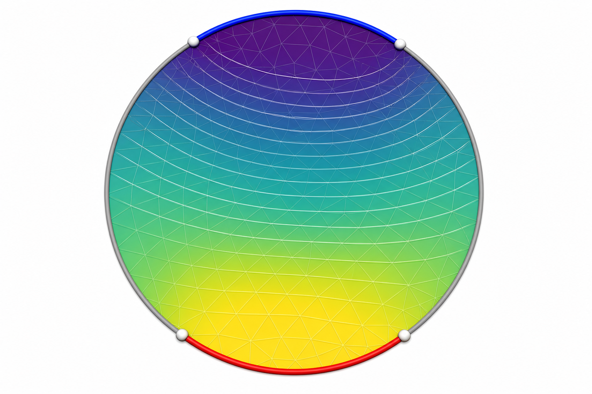

# 可微调和边界优化

这是一个干净、独立、通用的四端点优化器：在一张带单边界环的连通三角网格上，用四个循环有序端点定义两段目标弧，求解 harmonic field，并移动端点使场的梯度尽可能均匀。它不依赖相邻的 knitting 工程。

*AI 概念示意，不是数值实验截图。*

蓝弧趋向 $u=0$，红弧趋向 $u=1$，两段灰色边界采用自然 Neumann 条件。灰色边界没有被人为插值赋值。

## 从这里开始

如果你希望从零理解网格、harmonic field、Robin 边界、有限元、Schur complement、伴随梯度和 L-BFGS，请直接阅读：

**[零基础算法与数学完整教程](docs/algorithm-guide-zh.md)**

教程同时包含：

- AI 生成的直觉图；
- 精确的边界积分和 loss 图；
- Robin、Dirichlet、Neumann 的逐项对照、弹簧直觉和一维精确解；
- 当前代码重新计算的 Disk、Plane Polyscope 对比；
- Plane 为什么四角构型是零 loss 的全局最优解；
- “完全可微”在当前 P1 离散里的准确含义；
- 数学公式到具体函数的逐项映射。

## 核心定义

四个端点按展开后的边界弧长排序：

~~~text
k0 -- target 0 -- k1 -- free -- k2 -- target 1 -- k3 -- free -- k0+1
~~~

移动弧使用精确 P1 boundary-mass integral：

$$
Q(a,b)=\int_a^b\phi(s)\phi(s)^T\,ds,
$$

其端点导数为：

$$
\frac{\partial Q}{\partial a}=-\phi(a)\phi(a)^T,
\qquad
\frac{\partial Q}{\partial b}=+\phi(b)\phi(b)^T.
$$

因此端点可以连续跨过网格顶点，不会出现离散顶点集合突然切换的 active-set jump。内部自由度在初始化时通过 Schur complement 消元，并预计算 harmonic lift $E$；之后完整场统一写成 $u=Eu_B$，反向传播统一写成 $E^T(\partial L/\partial u)$。每次 objective evaluation 只需求解当前边界系统的一次前向和一次伴随 backsolve。

默认 loss 是 $|\nabla u|^2$ 的面积加权变异系数平方。通用默认值为：

~~~text
minimum_gap     = 0.03
boundary_penalty = 100
width_weight     = 0
~~~

## 快速运行

测试：

~~~bash
uv run pytest
~~~

运行一个 Disk 优化：

~~~bash
uv run python - <<'PY'
from boundary_opt import HarmonicBoundaryOptimizer, load_obj, random_knots

optimizer = HarmonicBoundaryOptimizer(load_obj("data/disk.obj"))
result = optimizer.optimize(random_knots(seed=0), max_iterations=100)
print(f"{result.initial_loss:.6f} -> {result.final_loss:.6f}")
print("knots:", result.knots % 1.0)
print("gaps:", result.gaps)
PY
~~~

当前 harmonic-lift 实现的 Disk seed 0 结果是 $15.684301\to0.240472$；Plane seed 0 是 $11.090487\to 8.7\times10^{-14}$。

扫描多个随机种子：

~~~bash
uv run python scan_mesh_seeds.py \
  --mesh data/triple_peak.obj \
  --seeds 16 \
  --output output/triple_peak_seed_scan.csv \
  --history-output output/triple_peak_seed_scan_history.csv
~~~

生成 loss 曲线：

~~~bash
uv run python plot_loss_curves.py \
  --history Triple-Peak output/triple_peak_seed_scan_history.csv \
  --svg output/triple_peak_loss_curves.svg
~~~

生成 Polyscope 前后对比：

~~~bash
uv run --extra visualization python visualize_mesh_optimization.py \
  --mesh data/disk.obj \
  --seed 0 \
  --screenshot output/disk_before_after.png
~~~

播放优化动画：

~~~bash
uv run --extra visualization python visualize_mesh_optimization.py \
  --mesh data/disk.obj \
  --seed 0 \
  --animate \
  --fps 8
~~~

重新生成教程中的精确 SVG：

~~~bash
uv run python generate_tutorial_figures.py
~~~

## 文件地图

| 文件 | 用途 |
|---|---|
| <code>boundary_opt.py</code> | 网格、边界参数化、P1/FEM、Schur、loss、伴随梯度、L-BFGS |
| <code>scan_mesh_seeds.py</code> | 对任意支持的 mesh 扫描随机 seed |
| <code>plot_loss_curves.py</code> | 从 history CSV 生成 SVG loss 图 |
| <code>visualize_mesh_optimization.py</code> | Polyscope 静态前后对比与优化动画 |
| <code>generate_tutorial_figures.py</code> | 生成教程使用的精确 SVG |
| <code>tests/test_boundary_opt.py</code> | 解析梯度、端点连续性、Plane sanity check 等测试 |
| <code>docs/algorithm-guide-zh.md</code> | 零基础完整技术教程 |

## 当前适用范围

- 连通三角网格；
- 恰好一个 manifold boundary loop；
- 两段目标弧和两段自由弧；
- P1 有限元与 Robin 边界惩罚；
- 一阶局部优化。

L-BFGS 能寻找 local minimum，但不保证 global minimum；建议对新模型运行多个随机 seed。Robin 在有限 $\rho$ 下逼近硬 Dirichlet，当前端点 pipeline 是 $C^1$，一般不是 $C^\infty$。
