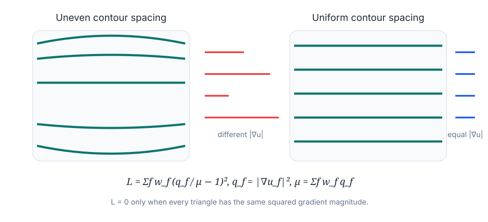
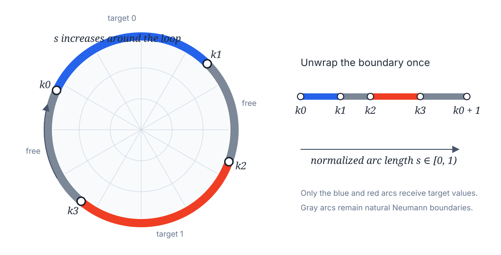
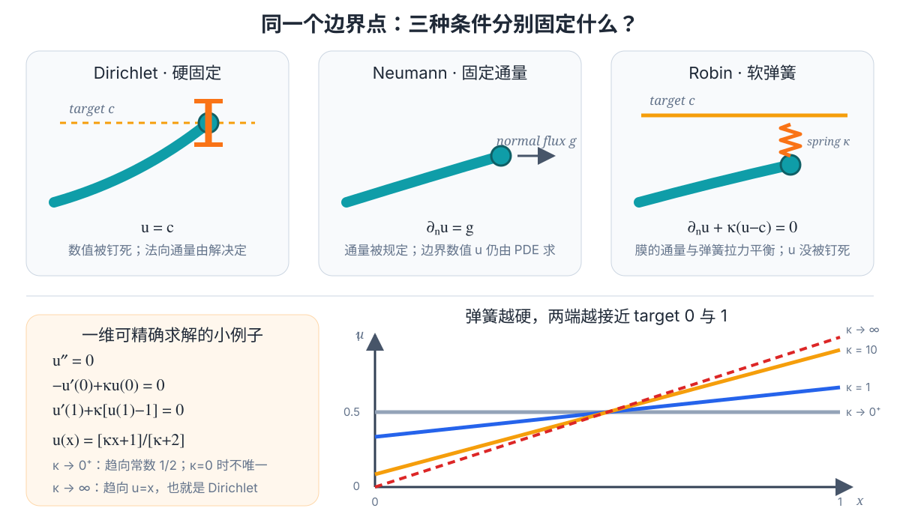
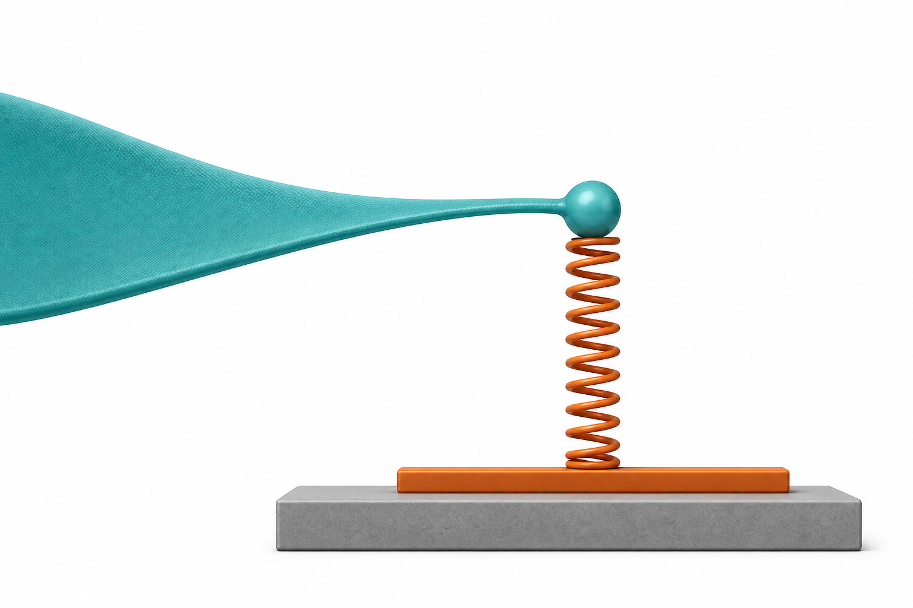
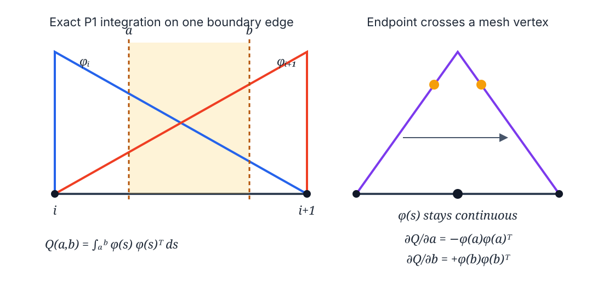
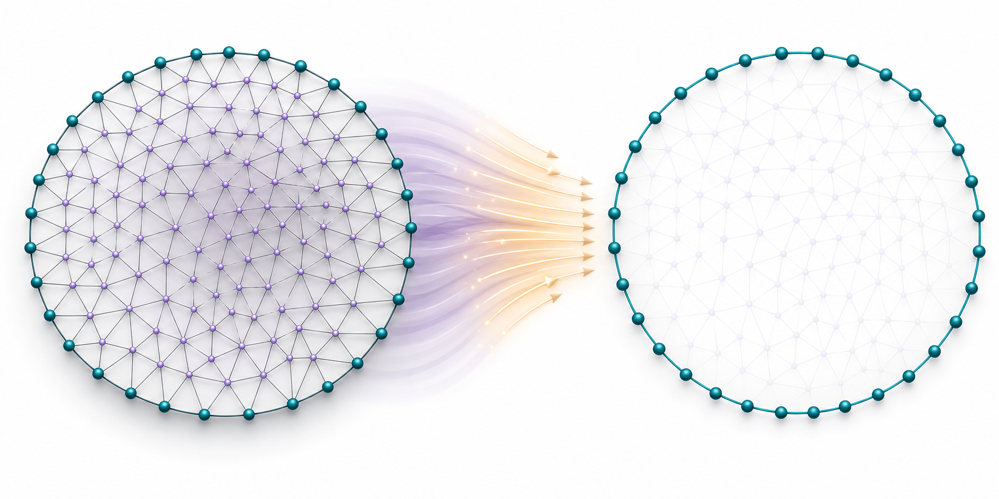
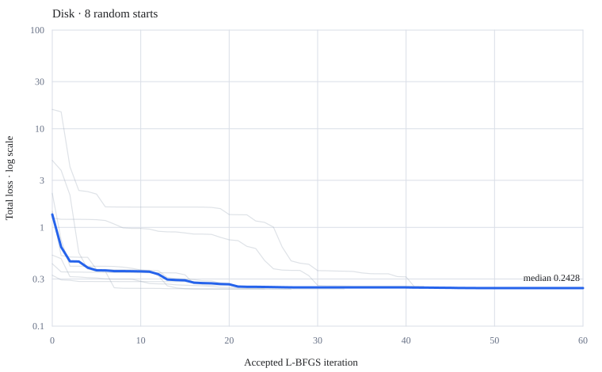
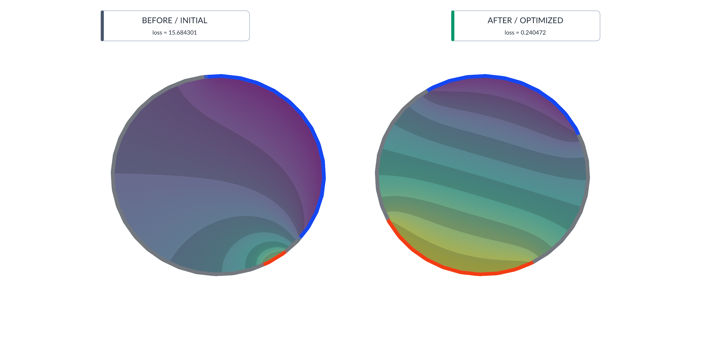
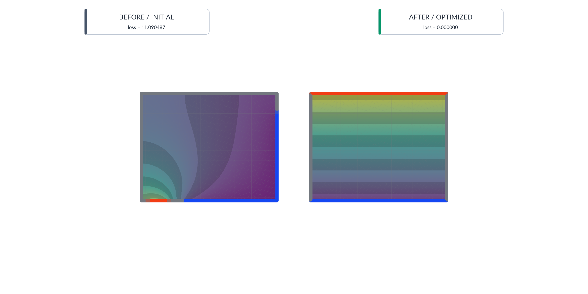

# 从圆盘边界的四个点，到均匀的调和场

这是一篇从零开始的教程。你不需要预先懂偏微分方程、有限元、伴随法或 L-BFGS。读完后，你应该能回答四个问题：

1. 我们到底在优化什么？
2. 给定四个任意的合法边界端点，场是怎样算出来的？
3. 为什么整条计算链可以对四个参数求导？
4. 为什么 Plane 的最优端点是四个角，而 Disk 通常只能到一个非零 loss？

本文始终用 Disk 作主例子。蓝色边界弧的目标值是 0，红色边界弧的目标值是 1，灰色边界是自由边界。

> 图中凡标注“AI 概念示意”的，只用于建立直觉；公式、loss 曲线和 Polyscope 结果都来自当前代码或精确绘图。

---

## 1. 先用一句话说清任务

我们有一张带边界的三角网格，想在它上面生成一个从 0 平滑过渡到 1 的标量场。边界上只有两段弧被指定目标值，另外两段保持自由。算法移动四个弧端点，使整个网格上的场尽可能“匀速变化”。

*AI 概念示意：四颗白色珠子是端点；蓝弧趋近 0，红弧趋近 1，灰弧不指定数值；内部颜色由调和方程自动补全。*

完整流程可以先记成：

这里的“精确梯度”是指：相对于当前离散有限元模型，梯度由解析公式和线性方程求出；它不是有限差分近似，也不需要 JAX。

---

## 2. 三角网格、标量场和梯度是什么？

### 2.1 三角网格

一张三角网格由两样东西组成：

- 顶点：空间中的点，记作 $v_1,v_2,\ldots,v_V$；
- 三角形：每个三角形记录三个顶点编号。

Disk 数据里有：

- $V=4317$ 个顶点；
- $F=8423$ 个三角形；
- $B=209$ 个边界顶点；
- $I=4108$ 个内部顶点。

算法要求网格连通，并且只有一条流形边界环。它不是专门为圆盘写的；Disk、Plane、Peak、Triple Peak 只要满足这个拓扑条件，都走同一套算法。

### 2.2 标量场

给每个顶点放一个实数，就得到一个标量场：

$$
u=(u_1,u_2,\ldots,u_V)^T.
$$

可以把 $u$ 想成温度、高度或电势：

- 紫色接近 0；
- 黄色接近 1；
- 中间颜色是 0 和 1 之间的过渡。

在每个三角形内部，P1 有限元用三个顶点值做线性插值。因此：

- $u$ 在三角形内部是线性的；
- 相邻三角形边界上的 $u$ 连续；
- 每个三角形里的空间梯度 $\nabla u$ 是常向量。

### 2.3 梯度

$\nabla u$ 回答两个问题：

- 朝哪个方向，$u$ 增长最快？
- 每走一单位距离，$u$ 大约改变多少？

它的长度 $|\nabla u|$ 越大，颜色变化越快，等值线越密。相邻等值线的数值差固定为 $\Delta u$ 时，几何间距近似为

$$
\Delta d \approx \frac{\Delta u}{|\nabla u|}.
$$

所以，如果每个三角形的 $|\nabla u|$ 相近，等值线间距就会更均匀。

*精确示意图：左边的梯度大小差异很大；右边的梯度大小接近一致。*

注意两个不同的“梯度”：

- $\nabla u$：场在网格表面上的空间梯度，是一个三维向量；
- $\nabla_\theta L$：loss 对四个优化参数的梯度，是一个四维向量。

它们名字相似，但不是同一个东西。

---

## 3. 什么叫 harmonic field？

如果一个区域内部没有热源、没有电荷，稳定状态满足 Laplace 方程：

$$
\Delta_{\mathcal M}u=0.
$$

这样的 $u$ 叫调和场。直觉上，它不会凭空制造尖峰或凹坑，而是在边界条件允许的范围内尽量平滑。

同一个事实还可以用能量来表达：在给定相应边界条件的允许函数集合内，调和场最小化 Dirichlet 能量：

$$
E_{\mathrm{smooth}}(u)
=
\frac12\int_{\mathcal M}|\nabla u|^2\,dA.
$$

如果完全不施加任何边界作用，单独最小化这个能量只会得到任意常数场。当前实现真正最小化的是第 5 节写出的“Dirichlet 能量 + 两段 Robin 边界能量”。

这很像一张有弹性的膜：边界怎样拉住它，内部就自动找到最省能量的形状。这里的“膜高度”不是网格的真实几何高度，而是标量值 $u$。

---

## 4. 四个端点如何定义两段边界条件？

先沿整条边界走一圈，用归一化弧长 $s\in[0,1)$ 标记位置。$s=0$ 和 $s=1$ 是同一点。

把闭合边界临时“剪开并拉直”，四个端点满足

$$
k_0<k_1<k_2<k_3<k_0+1.
$$

它们把边界分成四段：

$$
\underbrace{[k_0,k_1]}_{\Gamma_0:\ \text{目标 }0},
\quad
\underbrace{[k_1,k_2]}_{\text{自由}},
\quad
\underbrace{[k_2,k_3]}_{\Gamma_1:\ \text{目标 }1},
\quad
\underbrace{[k_3,k_0+1]}_{\text{自由}}.
$$

*精确示意图：圆上的定义和把边界拉直后的定义完全等价。图中的位置只用于解释参数，不是某次实验结果。*

### 最容易误解的一点

灰色边界上的中间点不需要预先插值，也不需要被赋成从 0 到 1 的某个值。

给定任意四个合法端点之后，我们已经有了一个完整的边值问题：

- 蓝弧通过 Robin 项趋向 0；
- 红弧通过 Robin 项趋向 1；
- 灰弧自动采用自然 Neumann 条件；
- 内部和灰弧上的所有未知值一起由线性方程求出。

当前代码在端点落到某条边内部时，确实会线性评价 P1 基函数 $\phi(s)$。这是为了精确计算“边界积分截到这条边的多少”，不是在灰色边界上人为插入边界值。这两个概念必须分开。

---

## 5. Robin 到底是什么？为什么这里使用它？

### 5.1 “边界条件”先在规定什么？

方程

$$
\Delta_{\mathcal M}u=0
$$

只规定了区域内部怎样平衡。走到边界时，还必须告诉方程“边界允许怎样响应”，否则解通常不唯一。

设一段边界的目标值为 $c$。三种常见边界条件限制的是三件不同的事：

| 类型 | 数学形式 | 真正被固定的量 | 膜的直觉 |
|---|---|---|---|
| Dirichlet | $u=c$ | 直接固定场值 | 把膜边缘钉在高度 $c$ |
| Neumann | $\partial_\nu u=g$ | 固定法向变化率或通量 | 不钉高度，只规定边缘受到的法向拉力 |
| Robin | $\partial_\nu u+\kappa(u-c)=0$ | 让通量与“偏离目标的距离”平衡 | 用有限刚度 $\kappa$ 的弹簧把边缘拉向 $c$ |

这里

$$
\partial_\nu u
=
\nabla_{\mathcal M}u\cdot\nu
$$

是沿边界外余法向 $\nu$ 的导数。$\nu$ 位于曲面的切平面内，同时垂直于边界切线并指向区域外；它不是三角形在三维空间中的面法线。

还要避免一个名字造成的混淆：

- Dirichlet energy 是内部平滑能量 $\frac12\int|\nabla u|^2dA$；
- Dirichlet boundary condition 才是直接规定 $u=c$。

它们不是一回事。

*精确示意图：上排比较三种条件到底固定什么；下排用一个可精确求解的一维问题显示弹簧从 Neumann 极限逐渐变成 Dirichlet 极限。*

### 5.2 Robin 就是一根“没有焊死”的边界弹簧

*AI 概念示意：青色膜的边界点没有被钉在橙色目标轨道上，而是通过弹簧被拉向它。图中的竖直高度表示场值，不是 mesh 的真实几何高度。*

先只看一段目标弧 $\Gamma_c$。在平滑能量之外加入

$$
E_{\mathrm{spring}}
=
\frac{\kappa}{2}
\int_{\Gamma_c}(u-c)^2\,d\ell.
$$

这相当于沿弧安装一排弹簧：

- 弹簧锚点的目标高度是 $c$；
- 当前边界场值是 $u$；
- 弹簧伸长量是 $u-c$；
- 恢复力大小与 $\kappa(u-c)$ 成正比；
- $\kappa$ 越大，弹簧越硬。

关键是：有限刚度的弹簧不会把边界焊死。

当膜的内部也在拉这个边界点时，最终位置要同时满足两股作用的平衡：

$$
\boxed{
\partial_\nu u+\kappa(u-c)=0
}
$$

也就是

$$
-\partial_\nu u=\kappa(u-c).
$$

左边来自内部调和膜在边界处的作用，右边来自弹簧。只有两者平衡，边界点才停止移动。

这也解释了为什么有限 $\kappa$ 时通常

$$
u\ne c.
$$

如果 $u=c$，弹簧恰好没有形变；但 PDE 并没有要求弹簧必须没有形变。只要弹簧拉力能够平衡内部作用，$u$ 就可以与 $c$ 存在有限差距。

### 5.3 用热传导再理解一次

把 $u$ 看成温度，假设导热系数为 1。向外热流是

$$
q_{\mathrm{out}}=-\partial_\nu u.
$$

Robin 条件可写成

$$
q_{\mathrm{out}}=\kappa(u-c).
$$

其中 $c$ 是外部环境温度：

- 边界比环境热，即 $u>c$：右侧为正，热量向外流；
- 边界比环境冷，即 $u<c$：右侧为负，热量从外部流入；
- 边界恰好等于环境，即 $u=c$：交换热流为零。

因此 Robin 也叫对流换热边界条件。它没有直接规定边界温度，而是规定“温差越大，交换越强”。

### 5.4 $\kappa$ 的三个极限

现在可以准确理解弹簧强度：

1. 没有弹簧，$\kappa=0$

   $$
   \partial_\nu u=0.
   $$

   Robin 退化为齐次 Neumann：不规定边界值，也没有法向通量。

2. 有限弹簧，$0<\kappa<\infty$

   $$
   \partial_\nu u=-\kappa(u-c).
   $$

   这是软约束。$u$ 被拉向 $c$，但一般不会精确等于 $c$。

3. 无限硬弹簧，$\kappa\to\infty$

   如果法向导数保持有限，为了让等式成立，只能有

   $$
   u\to c.
   $$

   这才趋近硬 Dirichlet。数值计算不会真的取无穷大；过大的系数还会让线性系统的 condition number（病态程度）变差。

所以“Robin 目标为 0”准确的意思是“用弹簧拉向 0”，不是“边界已经严格等于 0”。

### 5.5 一个可以手算到底的一维例子

考虑区间 $x\in[0,1]$。内部没有源：

$$
-u''(x)=0.
$$

在左端安装目标为 0 的弹簧，在右端安装目标为 1 的弹簧：

$$
E[u]
=
\frac12\int_0^1[u'(x)]^2\,dx
+\frac{\kappa}{2}u(0)^2
+\frac{\kappa}{2}[u(1)-1]^2.
$$

区间左端的外法向（outward normal）指向负方向，右端指向正方向，因此两个 Robin 条件的符号不同：

$$
-u'(0)+\kappa u(0)=0,
$$

$$
u'(1)+\kappa[u(1)-1]=0.
$$

因为 $u''=0$，解一定是一条直线。代入两端条件可以得到

$$
\boxed{
u(x)=\frac{\kappa x+1}{\kappa+2}
}
$$

从这个公式直接读出：

$$
u(0)=\frac{1}{\kappa+2},
\qquad
u(1)=1-\frac{1}{\kappa+2}.
$$

几个具体数值：

| $\kappa$ | $u(0)$ | $u(1)$ | 含义 |
|---:|---:|---:|---|
| $1$ | $1/3$ | $2/3$ | 弹簧很软，两端离目标仍很远 |
| $10$ | $1/12$ | $11/12$ | 更接近 0 和 1，但仍不精确 |
| $100$ | $1/102$ | $101/102$ | 已很接近硬约束 |
| $\infty$ | $0$ | $1$ | Dirichlet 极限 |

当 $\kappa\to0^+$ 时，这组对称弱弹簧选出的解趋向常数 $1/2$。但在 $\kappa=0$ 本身，两个弹簧都消失，任何常数都是解，因此问题并不唯一。

这就是“软约束”的完整含义：不是先把 0 和 1 插值，而是 PDE 与两个有限强度的边界弹簧共同决定整条直线。

### 5.6 当前代码里的 $\rho$ 与公式里的 $\kappa$

代码不是按物理弧长 $\ell$ 积分，而是先把整条边界归一化为

$$
s=\frac{\ell}{P}\in[0,1),
\qquad
ds=\frac{d\ell}{P},
$$

其中 $P$ 是边界总周长。代码保存的参数叫

$$
\rho=\texttt{boundary\_penalty},
$$

默认值为 100。它与物理强形式里的弹簧系数关系为

$$
\boxed{
\kappa=\frac{\rho}{P}
}
$$

因此：

- 代码里的 $\rho$ 是与归一化弧长配套的无量纲权重；
- 强形式 $\partial_\nu u+\kappa(u-c)=0$ 中的有效系数是 $\rho/P$；
- 如果已有希望保持的物理系数 $\kappa$，应设置 $\rho=\kappa P$；
- 不能在使用归一化 $ds$ 后又额外除两次 $P$。

### 5.7 当前两段目标弧的完整能量

当前问题有两排弹簧：

- 蓝弧 $\Gamma_0$ 的锚点是 $c=0$；
- 红弧 $\Gamma_1$ 的锚点是 $c=1$；
- 两段灰弧没有弹簧。

连续能量是

$$
\begin{aligned}
E(u;k)
={}&
\frac12\int_{\mathcal M}|\nabla_{\mathcal M}u|^2\,dA\\
&+\frac{\rho}{2}\int_{\Gamma_0(k)}u^2\,ds\\
&+\frac{\rho}{2}\int_{\Gamma_1(k)}(u-1)^2\,ds.
\end{aligned}
$$

第一项让内部平滑；第二项把蓝弧拉向 0；第三项把红弧拉向 1。

对 $u$ 做一阶变分，得到弱形式：

$$
\int_{\mathcal M}
\nabla_{\mathcal M}u\cdot\nabla_{\mathcal M}v\,dA
+\rho\int_{\Gamma_0}uv\,ds
+\rho\int_{\Gamma_1}(u-1)v\,ds
=0
$$

对所有测试函数 $v$ 成立。

把归一化弧长换回物理弧长并分部积分，可读出强形式：

$$
\begin{cases}
-\Delta_{\mathcal M}u=0,
&\text{在内部},\\[1ex]
\partial_\nu u+\dfrac{\rho}{P}u=0,
&\text{在蓝弧 }\Gamma_0,\\[2ex]
\partial_\nu u+\dfrac{\rho}{P}(u-1)=0,
&\text{在红弧 }\Gamma_1,\\[2ex]
\partial_\nu u=0,
&\text{在灰色自由弧}.
\end{cases}
$$

在四个弧端点处不需要再添加单独的点条件；这些分段边界条件按“几乎处处”（允许有限个端点例外）的意义成立，而有限元真正使用的是弱形式。

### 5.8 为什么灰色“自由弧”自动是 Neumann？

灰弧没有出现在两项弹簧能量里。变分并分部积分后，灰弧只剩下

$$
\int_{\Gamma_{\mathrm{free}}}
\partial_\nu u\,v\,d\ell.
$$

测试函数 $v$ 在灰弧上可以任意变化。要让这项对所有 $v$ 都为零，只能有

$$
\partial_\nu u=0.
$$

所以灰弧不是“没有边界条件”，而是自动采用自然 Neumann 条件：

- 不预先规定灰弧上的 $u$；
- 不允许场沿边界外法向流入或流出；
- 灰弧上的值与内部值一起由 PDE 求出。

而且 $\partial_\nu u=0$ 只禁止法向变化，$u$ 仍可沿灰弧的切向变化；灰弧不需要是常数。

### 5.9 为什么 Robin 适合移动端点？

最直接的离散硬 Dirichlet 做法会选择一组网格顶点并把它们固定为 0 或 1。端点一旦跨过某个边界顶点，“被固定的顶点集合”就突然改变，系统和 loss 容易出现 active-set jump。

当前实现使用“有限 Robin 弹簧 + 精确移动弧积分”：

$$
Q(a,b)=\int_a^b\phi(s)\phi(s)^T\,ds.
$$

端点移动一小段，只会连续增加或减少一小片积分，并且

$$
\frac{\partial Q}{\partial a}
=-\phi(a)\phi(a)^T,
\qquad
\frac{\partial Q}{\partial b}
=+\phi(b)\phi(b)^T.
$$

P1 基函数 $\phi(s)$ 穿过边界顶点时数值连续，所以 $Q$ 及其一阶导数也连续。只要线性系统保持可逆，场和 loss 就随端点 $C^1$ 变化。

这里不能只说“用了 Robin，所以一定可微”。真正起作用的是两个条件同时成立：

1. 目标弧用有限强度的积分 penalty，而不是切换硬约束顶点集合；
2. 端点允许停在边内部，并对被截取的部分做 exact P1 integration。

如果仍把端点吸附到顶点或整条边，即使用 Robin，也可能重新产生跳变。

### 5.10 读到这里应该排除的四个误解

1. Robin 不是“一部分 Dirichlet 加一部分 Neumann”。同一个边界点同时满足的是一条联合平衡关系。
2. 有限 $\rho$ 不是硬 Dirichlet。蓝红弧只会趋近 0 和 1。
3. 灰弧不是把 0 和 1 插值起来。灰弧上的 $u$ 完全由 PDE 求出。
4. Neumann 的 $\partial_\nu u=0$ 不代表 $u=0$，也不代表灰弧为常数。

---

## 6. 有限元怎样把它变成线性方程？

### 6.1 P1 基函数

每个网格顶点有一个帽子形基函数 $\phi_i$：

- 在自己的顶点等于 1；
- 在相邻顶点等于 0；
- 在边和三角形内部线性变化。

于是

$$
u(x)=\sum_i u_i\phi_i(x).
$$

### 6.2 一段会移动的边界弧

定义边界质量矩阵

$$
Q(a,b)=\int_a^b \phi(s)\phi(s)^T\,ds.
$$

它描述边界弧 $[a,b]$ 对所有边界顶点自由度的影响。假设某条边占总周长的归一化长度为 $h$，弧在这条边上覆盖局部区间 $[\alpha,\beta]\subset[0,1]$。用局部坐标 $t\in[0,1]$ 表示时，两个基函数是

$$
\phi_i(t)=1-t,\qquad \phi_{i+1}(t)=t.
$$

只需积三个二次多项式；下面列出的是它们的三次原函数：

$$
\begin{aligned}
F_{00}(t)&=t-t^2+\frac{t^3}{3},\\
F_{01}(t)&=\frac{t^2}{2}-\frac{t^3}{3},\\
F_{11}(t)&=\frac{t^3}{3}.
\end{aligned}
$$

局部矩阵就是

$$
h
\begin{bmatrix}
F_{00}(\beta)-F_{00}(\alpha) & F_{01}(\beta)-F_{01}(\alpha)\\
F_{01}(\beta)-F_{01}(\alpha) & F_{11}(\beta)-F_{11}(\alpha)
\end{bmatrix}.
$$

*精确解析图：积分上下限可以停在边内部，也可以连续越过一个网格顶点。*

### 6.3 端点导数为什么这么简单？

Leibniz 公式告诉我们：

$$
\frac{\partial Q}{\partial a}
=-\phi(a)\phi(a)^T,
\qquad
\frac{\partial Q}{\partial b}
=+\phi(b)\phi(b)^T.
$$

端点跨过边界顶点时，P1 基函数 $\phi(s)$ 本身连续，所以 $Q$ 及其一阶导数连续。也就是说，这条离散 pipeline 是 $C^1$ 的，适合基于梯度的一阶优化。

严谨地说，它一般不是 $C^\infty$：P1 基函数的斜率会在顶点处改变，因此二阶导数可能跳变。本文所说的“完全可微”是工程语境下的端到端一阶可微，不是“任意阶都光滑”。

### 6.4 完整线性系统

令

$$
Q_0=Q(k_0,k_1),
\qquad
Q_1=Q(k_2,k_3).
$$

把边界矩阵嵌入全体顶点后，场满足

$$
\left[K+\rho E_B(Q_0+Q_1)E_B^T\right]u
=
\rho E_BQ_1\mathbf 1_B.
$$

$E_B$ 只是一个索引嵌入：它把边界向量放回全网格的对应位置。右侧只有 $Q_1$，因为红弧的目标是 1；蓝弧目标是 0，所以它对右侧贡献为 0。

给定任意四个合法端点，$Q_0,Q_1$ 就确定了；线性系统也就确定了。没有任何“先给灰色边界补值”的步骤。

---

## 7. Schur complement：为什么每轮只解边界系统？

Disk 有 4317 个顶点，但只有 209 个边界顶点。端点移动只会改变边界项，内部刚度从头到尾不变，因此可以把内部未知量预先消掉。

把顶点分为内部 $I$ 和边界 $B$：

$$
K=
\begin{bmatrix}
K_{II} & K_{IB}\\
K_{BI} & K_{BB}
\end{bmatrix},
\qquad
u=
\begin{bmatrix}
u_I\\
u_B
\end{bmatrix}.
$$

内部没有边界惩罚，所以

$$
K_{II}u_I+K_{IB}u_B=0.
$$

得到固定的 harmonic extension：

$$
u_I=Hu_B,
\qquad
H=-K_{II}^{-1}K_{IB}.
$$

当前实现再把“边界值原样保留”和“内部按 $H$ 恢复”合并成一个矩阵：

$$
E\in\mathbb R^{V\times B},
\qquad
E_{B,:}=I,
\qquad
E_{I,:}=H.
$$

这里 $E$ 叫 harmonic lift。给定任意边界向量 $u_B$，完整场只需写成

$$
\boxed{u=Eu_B}.
$$

可以把 $E$ 的第 $j$ 列理解成：只把第 $j$ 个边界自由度设成 1、其余边界自由度设成 0 后，向内部做出的 harmonic extension。一般的边界场只是这些列的线性组合。

代回边界方程，得到 Schur complement：

$$
S=E^TKE
=K_{BB}+K_{BI}H.
$$

代码仍用右边的分块公式计算 $S$，因为它不需要再做一次完整的 $E^TKE$ 乘法；但保存状态和传播梯度时使用左边更统一的 $E$ 记号。

每次端点变化时只需求解

$$
\underbrace{\left[S+\rho(Q_0+Q_1)\right]}_{A(k)}
u_B
=
\underbrace{\rho Q_1\mathbf 1_B}_{b(k)}.
$$

然后用一次 $u=Eu_B$ 恢复完整场，不再分别对边界和内部赋值。

连通网格的 $K$ 原本有一个“整体加同一常数”的零空间。两段正长度 Robin 弧会固定这个自由度，所以 reduced matrix $A(k)$ 是正定的，可以稳定地使用 Cholesky。

*AI 概念示意：左边的全网格被压缩为右边的边界系统；淡色内部表示它没有被丢弃，而是可由边界值精确恢复。*

这一步的实际意义很大：

- 预处理时分解一次固定的 $K_{II}$；
- 每次 objective evaluation 只构造并 Cholesky 分解 $B\times B$ 的 $A(k)$；
- Disk 从 4317 维的全系统降到 209 维的边界系统；
- 前向解和伴随解共享同一个 Cholesky factor。

当前实现采用 dense Schur，适合 $B\ll V$ 的普通曲面 patch。若网格很薄、边界点数量和总顶点数同量级，则应考虑 sparse fallback。

---

## 8. loss 到底在奖励什么？

对每个三角形 $f$，计算

$$
g_f=\nabla u_f,
\qquad
q_f=\lVert g_f\rVert^2.
$$

再用三角形面积归一化为权重

$$
w_f=\frac{A_f}{\sum_j A_j},
\qquad
\sum_f w_f=1.
$$

定义面积加权平均平方梯度

$$
\mu=\sum_f w_f q_f
$$

以及归一化平方梯度

$$
z_f=\frac{q_f}{\mu}.
$$

最终均匀性 loss 是

$$
\boxed{
L_{\mathrm{uniform}}
=
\sum_f w_f(z_f-1)^2
}
$$

它等于 $q_f=|\nabla u_f|^2$ 的面积加权 coefficient of variation 的平方：

$$
L_{\mathrm{uniform}}
=
\frac{\operatorname{Var}_w(q)}{\mu^2}.
$$

因此：

- $L=0$：每个三角形的平方梯度都相同；
- $L$ 大：有些地方变化很快，有些地方几乎不变；
- 因为除以 $\mu$，把整个场统一放大不会改变 loss；
- 大三角形按面积获得更大权重，不会让密集采样区凭空支配目标。

代码输出里的 <code>spacing_cv</code> 是 $|\nabla u|$ 的变异系数，只是一个诊断量；优化的 loss 是 $|\nabla u|^2$ 的变异系数平方。两者不能混为一个指标。

### loss 对场的导数

如果你只想使用算法，可以跳过这一小节。为了说明它真的可微，定义

$$
m_2=\sum_f w_fz_f^2=L+1.
$$

则

$$
\frac{\partial L}{\partial q_f}
=
\frac{2w_f}{\mu}(z_f-m_2),
$$

又因为 $q_f=g_f^Tg_f$，

$$
\frac{\partial L}{\partial g_f}
=
\frac{4w_f}{\mu}(z_f-m_2)g_f.
$$

通过每个三角形的 P1 gradient basis，可以把这些局部导数汇总成

$$
r=\frac{\partial L}{\partial u}.
$$

---

## 9. 伴随法：为什么只再解一次方程？

前向系统是

$$
A(k)u_B(k)=b(k).
$$

如果对每个 $k_i$ 分别求 $\partial u/\partial k_i$，四个端点至少需要四次额外线性求解。伴随法把它压缩成一次。

因为完整场满足 $u=Eu_B$，链式法则直接给出 loss 对边界未知量的总敏感度：

$$
\boxed{\bar r_B=E^Tr}
=r_B+H^Tr_I.
$$

这正是 $E$ 写法最干净的地方：

- 前向把边界场“抬升”到完整网格：$u=Eu_B$；
- 反向用同一个线性映射的转置把敏感度收回边界：$\bar r_B=E^Tr$。

解一个伴随系统

$$
A(k)p_B=\bar r_B.
$$

$A$ 对称正定，所以这次求解可以复用前向解的 Cholesky factor。然后由

$$
dL=p_B^T(db-dA\,u_B)
$$

直接得到四个端点导数：

$$
\begin{aligned}
\frac{\partial L}{\partial k_0}
&=+\rho\,p(k_0)u(k_0),\\
\frac{\partial L}{\partial k_1}
&=-\rho\,p(k_1)u(k_1),\\
\frac{\partial L}{\partial k_2}
&=-\rho\,p(k_2)\left[1-u(k_2)\right],\\
\frac{\partial L}{\partial k_3}
&=+\rho\,p(k_3)\left[1-u(k_3)\right].
\end{aligned}
$$

这里的 $u(k_i)$ 和 $p(k_i)$ 是用连续的边界 P1 基函数在端点处评价的。仍然要强调：这是评价有限元函数，不是给自由边界插值一个人为的 boundary condition。

一次 objective evaluation 的核心成本因此是：

1. 一次边界 Cholesky factorization；
2. 一次前向 backsolve 得到 $u_B$；
3. 一次伴随 backsolve 得到 $p_B$；
4. 四个端点处的局部取值和四维梯度组装。

---

## 10. 如何保证四个端点永不交换顺序？

直接优化 $k_0,k_1,k_2,k_3$ 很麻烦：优化器可能让两个端点穿过彼此，甚至把某段弧压成零长度。

当前实现改为优化

$$
\theta=(o,\eta_0,\eta_1,\eta_2).
$$

$o$ 是起点，另外三个量和一个固定为 0 的 logit 一起进入 softmax。为避免和上一节的 adjoint $p_B$ 混淆，这里把 softmax 概率记作 $\pi$：

$$
\pi=\operatorname{softmax}(\eta_0,\eta_1,\eta_2,0).
$$

给定最小间距 $\varepsilon$，四段 gap 定义为

$$
g_i=\varepsilon+(1-4\varepsilon)\pi_i.
$$

因此自动满足

$$
g_i>\varepsilon,
\qquad
\sum_{i=0}^3g_i=1.
$$

最后累加：

$$
\begin{aligned}
k_0&=o,\\
k_1&=o+g_0,\\
k_2&=o+g_0+g_1,\\
k_3&=o+g_0+g_1+g_2.
\end{aligned}
$$

默认 $\varepsilon=0.03$。无论 L-BFGS 怎样更新 $\theta$，四个端点都保持循环有序，每段都不会消失。链式法则再把

$$
\frac{\partial L}{\partial k}
$$

乘以 knot Jacobian，得到优化器真正需要的

$$
\frac{\partial L}{\partial\theta}.
$$

---

## 11. 可选的 arc-width prior

如果应用确实希望两段目标弧接近指定长度 $t$，可以添加

$$
L_{\mathrm{width}}
=
\lambda\left[
\left(\frac{g_0-t}{t}\right)^2
+
\left(\frac{g_2-t}{t}\right)^2
\right].
$$

总 loss 为

$$
L=L_{\mathrm{uniform}}+L_{\mathrm{width}}.
$$

但通用默认值是

$$
\lambda=\texttt{width\_weight}=0.
$$

也就是说，默认算法只问“怎样让场最均匀”，不偷偷偏好某种弧长。Plane 四角 sanity check 尤其不能使用旧实验里的 $t=0.1,\lambda=0.1$ prior，否则优化目标已经被改变，四角解就不再是总 loss 的必然最优解。

---

## 12. L-BFGS 在做什么？它能找到 local minimum 吗？

L-BFGS 每轮拿到两个东西：

- 当前 loss $L(\theta)$；
- 当前四维梯度 $\nabla_\theta L$。

它用最近若干轮的参数与梯度变化近似曲率，再通过 line search 选择步长。它通常比固定学习率的梯度下降或 Adam 更适合这种“小维度、平滑、每次求值较贵”的确定性问题。

*当前实现计算结果：Disk，8 个随机初值，纵轴为对数刻度，粗线是逐 accepted iteration 的中位数。*

这张图说明两件事：

1. loss 通常下降，但不必匀速下降；line search 可能经历平台后突然找到更好的方向；
2. 不同初值的终点略有不同，说明问题是非凸的。

所以答案是：

- L-BFGS 能在常规条件下收敛到一个 stationary point，实践中通常是 local minimum；
- 它不能保证找到 global minimum；
- 最稳妥的做法是随机多个 seed，比较最终 loss，并检查梯度范数和几何结果；
- 对只有四个参数的问题，multistart 很便宜，也很自然。

Adam 并不会自动把非凸问题变成全局优化。这里没有随机 mini-batch，梯度也很精确，Adam 的噪声适应优势不明显；L-BFGS 的 line search 和曲率信息通常更合适。

---

## 13. Disk：从坏初始化到均匀场

下面是当前代码、默认参数、seed 0、100 次最大迭代得到的 Polyscope 截图：

*当前实现计算结果：左侧明确是初始状态，右侧是优化后状态。蓝色为目标 0，红色为目标 1，灰色为自由边界。*

参数为：

$$
\varepsilon=0.03,\qquad
\rho=100,\qquad
\texttt{width\_weight}=0.
$$

结果为：

- 初始 loss：$15.684301$；
- 最终 loss：$0.240472$；
- accepted L-BFGS iterations：57；
- objective evaluations：134；
- 最终四段 gaps：

$$
(0.256161,\ 0.224899,\ 0.271426,\ 0.247514).
$$

你可以从图上直接读到 loss 的几何含义：

- 初始场在右下角变化极快，等值线挤成一团；
- 优化后等值线大体平行、间距更均匀；
- Disk 的圆形边界法向不断变化，再加上 Robin/Neumann 的分段边界条件，所以最终 loss 通常不是 0。这里的原因是边界几何，不是表面曲率；当前 <code>disk.obj</code> 本身是平面网格。

这也解释了为什么旧版本出现的 0.06、0.02 和当前 0.24 不能只看数字比较：如果边界离散方式、Robin/Dirichlet 模型、width prior 或 loss 定义不同，它们是在优化不同的目标。教程中的数字全部来自当前 Robin + exact arc mass + unregularized width 的实现。

---

## 14. Plane：为什么理论最优是四个角？

对一个矩形平面，如果蓝弧和红弧分别覆盖一对相对的完整边，另外两条边自由，那么存在一个仿射场，例如沿竖直方向

$$
u(x,y)=ay+b.
$$

它满足：

- $\Delta u=0$，所以它是 harmonic；
- $\nabla u=(0,a)$ 在所有三角形上相同；
- 自由的左右边上法向导数为 0；
- 因此每个 $q_f=|\nabla u_f|^2$ 相同；
- 所以 $L_{\mathrm{uniform}}=0$。

要让两段目标弧恰好覆盖上下完整边，四个端点自然落在四个角上。

*当前实现计算结果：seed 0 从 $11.090487$ 收敛到约 $8.7\times10^{-14}$，截图显示为 0.000000；优化后的四个端点位于四个几何角。*

一个容易产生误判的细节：端点参数是归一化弧长，不是平面的 $x/y$ 坐标。如果矩形不是正方形，四个角在 $s$ 上不会等间隔为 $0,0.25,0.5,0.75$。当前 Plane 的角位置按选择的边界起点和方向表示，取模后约为

$$
0,\ 0.228646,\ 0.5,\ 0.728646.
$$

所以判断“是不是四个角”应看几何位置或边界累计弧长，而不能只看四个数字是否相差 0.25。

如果 Plane 没到四角，优先检查：

1. <code>width_weight</code> 是否真的是 0；
2. 是否还在用把端点吸附到顶点的旧 hard-selection 逻辑；
3. 是否错误地给灰色边界插了数值；
4. 是否拿旧 loss 和新 loss 比；
5. 是否只跑了一个不好的初值或过早停止。

Plane 是这套算法最重要的 sanity check：当前实现应能达到数值意义上的 0。

---

## 15. 从数学符号到代码

| 数学对象 | 代码位置 |
|---|---|
| OBJ 网格 | <code>load_obj</code> |
| 唯一边界环 $\Gamma$ | <code>boundary_loop</code> |
| 归一化弧长 $s$ | <code>boundary_arclength</code> |
| 参数 $\theta\to k,g$ | <code>knots_from_parameters</code> |
| cotangent stiffness $K$ | <code>cotangent_stiffness</code> |
| 三角形 $\nabla\phi_i$ | <code>face_gradient_basis</code> |
| harmonic lift $u=Eu_B$ | <code>_harmonic_lift</code> |
| 精确移动弧矩阵 $Q(a,b)$ | <code>HarmonicBoundaryOptimizer._arc_mass</code> |
| reduced system $A u_B=b$ | <code>_system_from_knots</code>、<code>_solve</code> |
| 均匀性 loss 与 $\partial L/\partial u$ | <code>_uniformity_loss_and_gradient</code> |
| 伴随端点梯度 | <code>loss_and_gradient</code> |
| L-BFGS | <code>optimize</code> |
| 多随机种子 | <code>scan_mesh_seeds.py</code> |
| loss 图 | <code>plot_loss_curves.py</code> |
| Polyscope 静态图与动画 | <code>visualize_mesh_optimization.py</code> |
| 本教程的精确 SVG | <code>generate_tutorial_figures.py</code> |

最短使用代码：

~~~python
from boundary_opt import HarmonicBoundaryOptimizer, load_obj, random_knots

optimizer = HarmonicBoundaryOptimizer(
    load_obj("data/disk.obj"),
    minimum_gap=0.03,
    boundary_penalty=100.0,
    width_weight=0.0,
)

result = optimizer.optimize(
    random_knots(seed=0, minimum_gap=0.03),
    max_iterations=100,
)

print(result.initial_loss, result.final_loss)
print(result.knots % 1.0)
print(result.gaps)
~~~

---

## 16. 如何复现实验和动画？

安装依赖并运行测试：

~~~bash
uv run pytest
~~~

重新生成本文中的精确 SVG：

~~~bash
uv run python generate_tutorial_figures.py
~~~

重新生成 Disk 的 Polyscope 前后对比：

~~~bash
uv run --extra visualization python visualize_mesh_optimization.py \
  --mesh data/disk.obj \
  --seed 0 \
  --iterations 100 \
  --minimum-gap 0.03 \
  --width-weight 0 \
  --boundary-penalty 100 \
  --screenshot docs/figures/disk-before-after.png
~~~

打开 Disk 的优化动画：

~~~bash
uv run --extra visualization python visualize_mesh_optimization.py \
  --mesh data/disk.obj \
  --seed 0 \
  --iterations 100 \
  --animate \
  --fps 8
~~~

扫描 Triple Peak 的多个随机初值：

~~~bash
uv run python scan_mesh_seeds.py \
  --mesh data/triple_peak.obj \
  --seeds 16 \
  --iterations 100 \
  --minimum-gap 0.03 \
  --width-weight 0 \
  --boundary-penalty 100 \
  --output output/triple_peak_seed_scan.csv \
  --history-output output/triple_peak_seed_scan_history.csv
~~~

---

## 17. 怎样确认梯度和实现没有 bug？

至少保留五层检查。

### 17.1 有限差分 gradient check

对每个参数方向 $e_i$，比较解析梯度和中心差分：

$$
\frac{\partial L}{\partial\theta_i}
\approx
\frac{L(\theta+h e_i)-L(\theta-h e_i)}{2h}.
$$

这能同时检查：

- loss 对场的导数；
- 伴随方程；
- 四个端点的正负号；
- softmax-gap Jacobian。

### 17.2 端点跨顶点测试

让一个端点从边界顶点左侧移动到右侧，检查：

- $Q$ 连续；
- $\partial Q/\partial k$ 连续；
- loss 和一阶梯度没有跳变。

### 17.3 Plane 四角测试

使用 <code>width_weight=0</code>，应该得到：

- 四个几何角；
- 仿射场；
- 数值上接近 0 的 uniformity loss。

### 17.4 多 seed 与可视化

优化器返回 success 不等于几何结果一定合理。还应检查：

- 多个 seed 的最终 loss 分布；
- gradient norm；
- 蓝、红、灰边界段是否与 knot 一致；
- 等值线是否真的更均匀；
- 左右截图是否明确标识初始与优化后。

### 17.5 为什么改写成 $u=Eu_B$ 会改变某个 seed 的终点？

旧写法分两块计算：

$$
u_B=z,
\qquad
u_I=Hz,
\qquad
\bar r_B=r_B+H^Tr_I.
$$

当前写法把它们合成：

$$
u=Ez,
\qquad
\bar r_B=E^Tr.
$$

在实数数学里，这两种写法完全相同。代码中的 $H$ 和 Schur matrix $S$ 也逐元素相同。区别仅来自 BLAS 对浮点加法采用了不同分组；而浮点加法不满足严格的结合律。

在 Plane、Disk 和 Triple-Peak 上对每个模型取 128 组相同参数，观察到的最大差异量级为：

| 比较量 | 最大绝对差量级 |
|---|---:|
| 完整场 $u$ | $2\times10^{-15}$ |
| loss | $2\times10^{-14}$ |
| 四维解析梯度 | $7\times10^{-12}$ |

这些都是双精度舍入量级，不表示 PDE、loss 或导数公式发生了改变。但 L-BFGS 是一个递归的非凸优化过程：本轮梯度决定 line search 接受哪个点，接受的点又决定下一轮近似 Hessian。如果迭代恰好靠近两个 basin 的分水岭，$10^{-12}$ 级扰动也可能在若干轮后发展成完全不同的轨迹。

Disk seed 0 就是一个例子：

$$
0.240305351
\quad\longrightarrow\quad
0.240471703.
$$

绝对差约为 $1.66\times10^{-4}$，相对差约为 $0.069\%$。两个结果是不同的浅 local minima，不是同一个线性系统被解错。

端点位置看起来相差很远时，还要先排除 target-swap 等价性：

$$
(k_0,k_1,k_2,k_3)
\mapsto
(k_2,k_3,k_0+1,k_1+1).
$$

这个变换交换目标 0 和目标 1，场随之变成 $1-u$，但 $|\nabla u|$ 和 uniformity loss 不变。Disk 还接近旋转对称，因此不同结果可以只是沿圆周转到另一个很浅的离散极小值。

更有意义的是看 multistart 分布。在 100 个 Disk seeds 上，旧分块写法与 harmonic-lift 写法分别得到：

| 指标 | 分块 $H$ | harmonic lift $E$ |
|---|---:|---:|
| median final loss | 0.250045 | 0.251065 |
| mean final loss | 0.255216 | 0.256134 |
| 同 seed 获得更低 loss 的次数 | 53 | 47 |

两组分布没有表现出实质性能差异。因此这里应区分两个概念：

- **方程级等价性**：同一参数处的场、loss 和梯度只差机器舍入；
- **轨迹级复现性**：非凸优化的同一 seed 不保证在代数重排后仍走同一条迭代路径。

另外两个模型的 100-seed 检查也没有显示 harmonic lift 退化：

- Plane 找到 $L<10^{-8}$ 四角解的次数从 94/100 变为 97/100；
- Triple-Peak 进入两个已知优质 basin 的次数从 99/100 变为 100/100。

这些差异不应解读成 $E$ 会提高优化质量；它们同样只是 basin 选择的随机性。真正结论是两种代数写法的 multistart 性能处于同一水平。

内存代价也很小。旧版永久保存 $H\in\mathbb R^{I\times B}$，当前版本用 $E\in\mathbb R^{V\times B}$ 替代它，并没有同时永久保存两份矩阵。因为 $V=I+B$，增加的内存恰好是

$$
8B^2\ \text{bytes}.
$$

| 模型 | 额外内存 |
|---|---:|
| Plane | 0.125 MiB |
| Disk | 0.333 MiB |
| Triple-Peak | 0.281 MiB |

每次前向和反向矩阵乘法也只多 $B^2$ 个矩阵元素；在当前 $B\ll V$ 的网格上，实测 objective 时间仍在同一量级。Schur matrix 继续用分块公式计算，并没有真的执行通用而更昂贵的 $E^TKE$。

如果研究目标要求逐位重现旧路径，就必须冻结旧分块写法、NumPy/SciPy、BLAS、硬件和线程配置。当前项目更重视数学结构清楚，因此选择前向 $E$、反向 $E^T$ 的统一写法，并用多个随机初值评价性能。

---

## 18. 当前算法的边界

当前实现有意保持小而清晰，它的适用范围是：

- 连通三角网格；
- 恰好一条 manifold boundary loop；
- 两段目标弧和两段自由弧；
- P1 有限元；
- Robin 边界惩罚；
- 一阶梯度优化。

需要知道的限制：

- 它是局部优化，不保证 global minimum；
- Robin 只是在有限 $\rho$ 下逼近硬 Dirichlet；
- pipeline 通常是 $C^1$，不是 $C^\infty$；
- 任意钝角网格上的 cotangent 离散不自动保证 discrete maximum principle；
- dense Schur 假设边界远小于整体；
- 代数等价的浮点重排可能改变某个 seed 最终进入的 local basin；
- 无边界网格、多个边界环或非流形边界会被拒绝；
- 当前只有两段目标弧；更多弧需要扩展参数化和右侧组装。

---

## 19. 最后把整个算法再讲一遍

1. 从 OBJ 读取三角网格，找到唯一边界环。
2. 用归一化弧长 $s$ 参数化边界。
3. 用 softmax gaps 把四个无约束参数变成四个有序端点。
4. 对蓝弧和红弧精确积分 P1 boundary mass，得到 $Q_0,Q_1$。
5. 用预计算的 Schur complement 构造边界系统。
6. 解一次前向方程，再用 harmonic lift $u=Eu_B$ 恢复全网格场。
7. 计算每个三角形的 $|\nabla u|^2$，得到面积加权均匀性 loss。
8. 解一次伴随方程，在四个端点处评价 $u$ 和 $p$。
9. 得到四个 knot 梯度，再通过 softmax Jacobian 变成参数梯度。
10. L-BFGS 更新四个参数，直到收敛。
11. 用多随机初值减少落入较差 local minimum 的风险。

最值得记住的三句话：

> 灰色边界不需要插值赋值；它是自然 Neumann 边界。

> 可微性的核心不是把端点吸附到顶点，而是对移动弧的 P1 质量矩阵做精确积分。

> Plane 的四角解来自“仿射 harmonic field 具有常梯度”，而 Disk 的圆形边界几何与分段边界条件通常让最优 loss 保持非零。

---

## 20. 小词典

| 词 | 直白解释 |
|---|---|
| scalar field | 每个网格顶点上的一个数 |
| harmonic | 内部没有源，场尽量平滑 |
| gradient | 数值变化最快的方向和速度 |
| isoline | 场值相同的一条线 |
| Dirichlet | 直接规定边界上的场值 |
| Neumann | 规定穿过边界的法向变化率 |
| Robin | 用边界弹簧把场拉向目标值 |
| P1 finite element | 三角形内做线性插值的有限元 |
| stiffness matrix | 把平滑能量写成矩阵的结果 |
| boundary mass | 边界积分 $\int\phi\phi^Tds$ 的矩阵 |
| Schur complement | 预先消掉内部未知量，只留下边界系统 |
| harmonic lift | 用 $u=Eu_B$ 把边界值一次性延拓到完整调和场 |
| adjoint | 用一次额外求解获得所有设计变量梯度 |
| softmax gaps | 自动保持端点顺序和最小间距的参数化 |
| L-BFGS | 使用梯度和少量历史曲率信息的局部优化器 |
| seed | 生成一个随机初始端点布局的编号 |
